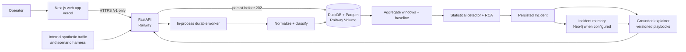

# Lumen — Payment Conversion Control Tower

Lumen is a **synthetic-payment monitoring and diagnosis system** for payment-operations teams. It turns a stream of attempted payments into auditable operational incidents: what changed, where it is concentrated, when it started, the estimated local-currency impact, the evidence behind the conclusion, and a recommended **human** action.

It is built for the challenge in [`C2.txt`](../C2.txt): detect meaningful approval-rate degradation without alerting on ordinary noise; isolate the responsible intersection of merchant, provider, payment method, country, issuing bank, and decline code; keep simultaneous problems separate; and explain the result without pretending that uncertain evidence is a confirmed cause.

> **Submission status — 30 August 2026.** The transaction-first backend pipeline was validated locally: batch → durable lifecycle → canonical event → aggregation → detector/RCA → persisted Incident → grounded transaction detail. The recorded local evidence is 168 Python tests, contract validation, compilation, and a public E2E without live fixtures. The **Input** form uses the live API; the current web **Logs**, **Detail**, and **Incidents** screens are explicitly labelled offline fixtures while their live adapter is pending. Railway Volume/restart/CORS and Vercel browser acceptance still require the project’s real deployment credentials and URLs; they are not claimed as completed here.

## What Lumen does

1. Accepts one to one hundred **synthetic, tokenized** payment attempts per batch.
2. Persists the batch before returning `202 Accepted`, then processes each attempt through a durable lifecycle.
3. Normalizes outcomes and calculates windowed conversion, baseline, latency, and impact metrics from the stored events.
4. Detects statistically relevant degradation and explores dimensional slices to form an evidence-backed root-cause hypothesis.
5. Creates or updates an Incident only when the evidence supports an episode; insufficient evidence remains explicitly `INCONCLUSIVE`.
6. Keeps incidents with different causal fingerprints separate, including simultaneous events.
7. Retrieves confirmed historical context and renders a grounded explanation and playbook recommendation. The recommendation is always `HUMAN_ONLY`: Lumen never reroutes, retries, captures, refunds, or executes a payment.

## Why this is useful

The operational question is not “did one transaction fail?” It is “is a material conversion drop happening, in which population, since when, and what should an operator investigate first?” A provider issue in Brazil and an issuing-bank outage for one Mexican merchant may happen in the same window. Lumen treats those as separate, auditable stories rather than one generic alert.

## System architecture



### Authority boundaries

| Layer | Is allowed to do | Is not allowed to do |
| --- | --- | --- |
| Web app | Collect facts, display backend records, poll while work is processing | Calculate conversion, progress, diagnosis, or root cause |
| API and worker | Persist, normalize, aggregate, detect, correlate, and expose records | Accept PAN, CVV, PII, or execute payments |
| Detector/RCA | Produce numerical candidates and ranked hypotheses from derived evidence | Treat an LLM response or a precedent as proof |
| Memory and explainer | Retrieve confirmed precedents and write a grounded explanation | Change the current diagnosis, metrics, or facts |

## Data flow and decision model

```text
Transaction input
  → persisted batch and lifecycle
  → normalized canonical attempt
  → metrics by time window and dimensional slice
  → baseline comparison and anomaly candidate
  → deterministic RCA/ranking
  → Incident with evidence, impact, confidence, and limitations
  → optional precedent retrieval and human-only recommendation
```

An Incident reports these operator-facing facts:

- **What:** observed conversion versus expected conversion.
- **Where / who:** the affected causal slice and population.
- **Since when:** the estimated start of the episode.
- **Impact:** expected approval shortfall and GMV at risk in the window’s own currency.
- **Why:** evidence IDs, concentration, decline profile, and ranked alternatives.
- **Confidence:** `SUPPORTED` or `INCONCLUSIVE`; the latter is a correct result, not an error.
- **Action:** `INVESTIGATE`, `MONITOR`, or `ESCALATE`, always with `execution: HUMAN_ONLY`.

### Important safeguards

- A repeated incident is **context**, not proof of the current cause. Memory status (`MATCH_FOUND`, `NO_PRECEDENT`, or `MEMORY_UNAVAILABLE`) remains separate from root-cause status.
- Incidents share an episode only when their correlation ID, overlapping window, and full causal-slice fingerprint match. Partial scope overlap is not enough.
- Impact is ranked only inside the same currency. Lumen does not silently compare BRL, MXN, and other currencies without a versioned FX decision.
- A sparse or ambiguous slice produces `INCONCLUSIVE`; it is never “completed” by an LLM narrative.
- All demo data is synthetic/tokenized. Real cardholder data is out of scope.

## Use Lumen in the demo

### 1. Start the backend

The project’s canonical runtime is Python 3.14.4. From the repository root:

```powershell
.\scripts\bootstrap-python.ps1
uv pip install --python .\.python-runtime\python.exe -e .
uv pip install --python .\.python-runtime\python.exe "pytest>=8.3" "httpx>=0.27"
$env:CORS_ALLOWED_ORIGINS = "http://localhost:3000"
.\.python-runtime\python.exe -m uvicorn main:app --reload --port 8000
```

The bootstrap installs the project’s embedded Python runtime; `uv` installs the project dependencies into that runtime. For a local demo, copy `.env.example` to `.env` and set only the values required for the environment. `LUMEN_DATA_DIR` should point to a writable local folder; `DEMO_MODE=true` enables the **internal-only** synthetic scenario harness. If you use `.env` instead of the command above, set `CORS_ALLOWED_ORIGINS=http://localhost:3000`. Do not put backend credentials in the web app.

Check readiness at:

```text
http://127.0.0.1:8000/v1/health
```

The health response distinguishes DuckDB/worker availability from optional Neo4j and OpenAI configuration.

### 2. Start the web app

In a second terminal:

```powershell
Set-Location web
npm ci
$env:NEXT_PUBLIC_API_BASE_URL = "http://127.0.0.1:8000/v1"
npm run dev
```

Open the URL printed by Next.js. The browser receives only `NEXT_PUBLIC_API_BASE_URL`; it must never receive DuckDB, Neo4j, OpenAI, or payment credentials. In the current build, **Input** is the live web integration. **Logs**, **Detail**, and **Incidents** intentionally display an `Offline fixtures` label; use the API or Swagger for persisted live records until their adapter is integrated.

### 3. Exercise the normal transaction path

1. Open **Input**.
2. Use the current catalog or **Generate sample transactions** to prepare 1–100 input rows. Samples contain facts only; no outcome, incident, or ground truth is exposed.
3. Submit the batch. Reusing the same `Idempotency-Key` with the same payload returns the original IDs; reusing it with a different payload returns `409`.
4. Inspect the batch, transaction, metrics, and persisted Incident through Swagger at `http://127.0.0.1:8000/docs` or the endpoints in the next section. This is the supported local path for live evidence today.
5. Use the labelled offline web **Logs**, **Detail**, and **Incidents** screens only to review the intended operator presentation states; do not present their fixture content as the result of the live batch.

### 4. Demonstrate controlled synthetic traffic

When `DEMO_MODE=true`, the backend exposes internal demo triggers. They are not a public payment-control API:

```text
POST /demo/background-traffic
POST /demo/scenarios/{scenario_id}/inject
```

Use them to build normal background volume, then inject a synthetic incident. The harness sends data through the same server-side ingestion boundary; it does not write directly to DuckDB. The ground truth used to assess an injection remains outside the public user input.

**Current mode boundary.** `DEMO_MODE=true` deliberately selects the fixture-backed Incident read adapter as well as enabling these internal trigger routes. To inspect the Incident actually persisted by an injection, keep the same `LUMEN_DATA_DIR`, stop the server, restart it with `DEMO_MODE=false`, and query `GET /v1/incidents` or `GET /v1/transactions/{id}/incidents`. The trigger endpoints then correctly return `403`. This prevents a fixture from being mistaken for a live diagnosis; it also means the current web Incident screen is not the surface for demonstrating the injected live result.

For the challenge narrative, demonstrate:

1. normal traffic with ordinary variation and no invented alert;
2. provider degradation concentrated in Brazil;
3. an issuing-bank problem concentrated in Mexico for one merchant at the same time;
4. an unfamiliar combination of dimensions; and
5. a low-evidence case that remains `INCONCLUSIVE`.

## Public API

The contract is [`contracts/v1/api.openapi.yaml`](contracts/v1/api.openapi.yaml). The frontend consumes it through a typed client; it is the only browser-to-backend integration surface.

| Endpoint | Purpose |
| --- | --- |
| `GET /v1/health` | Read API, worker, store, and optional dependency health |
| `GET /v1/transaction-catalog` | Obtain permitted synthetic input values and batch limit |
| `POST /v1/transaction-samples` | Generate valid editable synthetic inputs only |
| `POST /v1/transaction-batches` | Persist and queue 1–100 transaction inputs; requires `Idempotency-Key` |
| `GET /v1/transaction-batches/{batch_id}` | Inspect the batch lifecycle |
| `GET /v1/transactions` / `GET /v1/transactions/{id}` | Browse the newest-first log and a detailed record |
| `GET /v1/metrics/current` | Read derived current metrics and baselines |
| `GET /v1/incidents` / `GET /v1/incidents/{id}` | Read persisted incidents and grounded context |
| `GET /v1/transactions/{id}/incidents` | Read the authorized diagnosis trace for one transaction |

`202` means the initial durable records exist; it does not mean the payment outcome or analysis is already complete. Statuses have distinct meanings: `FAILED` is a provider outcome, while technical pipeline failure is represented by `UNKNOWN` with a processing-stage failure code. The OpenAPI contract describes the live API; the present web offline views are not evidence of a live response.

## Local verification

Run the backend checks from the repository root:

```powershell
uv pip install --python .\.python-runtime\python.exe "pytest>=8.3" "httpx>=0.27"
.\.python-runtime\python.exe scripts\validate_contracts.py
.\.python-runtime\python.exe -m pytest -q
.\.python-runtime\python.exe -m compileall -q app
```

Run the frontend checks from `web/`:

```powershell
npm run lint
npm test
npm run build
```

The local recovery record reports 168 passing Python tests, contract validation, and compilation. A benchmark run used 8,256 accepted synthetic events across 90 Parquet partitions; it is evidence of the ingest/materialization path, not a claim of production throughput. A holdout ground-truth evaluation and the live Railway/Vercel smoke remain intentionally unreported until executed.

## Deploy configuration

| Environment | Required configuration |
| --- | --- |
| Railway | `LUMEN_DATA_DIR`, explicit `CORS_ALLOWED_ORIGINS`, and optional Neo4j/OpenAI server-side secrets |
| Vercel | `NEXT_PUBLIC_API_BASE_URL` set to the public Railway `/v1` URL only |

Deploy in this order: Railway service + Volume → API health and contract smoke → worker restart/recovery check → Vercel preview → exact CORS allowlist → production smoke. The full runbook is [`docs/plans/deployment-vercel-railway.md`](docs/plans/deployment-vercel-railway.md).

## Repository map

| Path | Contents |
| --- | --- |
| `app/` | FastAPI, lifecycle worker, ingestion, aggregation, detection/RCA, incidents, memory, and explanation |
| `web/` | Next.js operator interface and typed API client |
| `contracts/v1/` | Versioned JSON schemas and OpenAPI contract |
| `config/generator/` | Reproducible synthetic-traffic configuration |
| `contracts/fixtures/` | Test and demo fixtures; never implicit live truth |
| `docs/plans/system-plan.md` | Current architectural source of truth |
| `docs/flight-log.md` | Complete append-only decision history |
| `FLIGHT_LOG-submit.md` | Jury-oriented, traceable decision-log submission |

## Scope and limitations

Lumen is a challenge MVP and a decision-support tool, not a payment processor. It deliberately has one stateful Railway replica in the MVP because DuckDB/Parquet reside on the attached Railway Volume. Scaling to replicas or HA requires a persistence-adapter migration (for example, to Railway Postgres) under change control; it does not justify changing the public API.

No user-facing claim should substitute for unrun evidence. In particular, browser acceptance, Railway restart persistence, production CORS, and a holdout accuracy score must be recorded only after their respective checks have been performed.

## Decision record

The full rationale, alternatives, trade-offs, evidence, and revision triggers are preserved in [`docs/flight-log.md`](docs/flight-log.md). The submission-ready version is [`FLIGHT_LOG-submit.md`](FLIGHT_LOG-submit.md).
