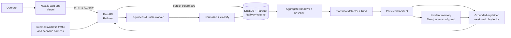

# Lumen — Payment Conversion Control Tower

Lumen is a **synthetic-payment monitoring and diagnosis system** for payment-operations teams. It turns a stream of attempted payments into auditable operational incidents: what changed, where it is concentrated, when it started, the estimated local-currency impact, the evidence behind the conclusion, and a recommended **human** action.

It is built for the challenge "Control Tower": detect meaningful approval-rate degradation without alerting on ordinary noise; isolate the responsible intersection of merchant, provider, payment method, country, issuing bank, and decline code; keep simultaneous problems separate; and explain the result without pretending that uncertain evidence is a confirmed cause.

> **Submission status — 30 August 2026.** The transaction-first path is implemented from batch input through durable lifecycle, canonical event, aggregation, detector/RCA, persisted Incident, grounded detail, notification, and human review. The current backend suite has **291 passing tests**. The Next.js operator interface is deployed on Vercel, while the FastAPI API and durable worker are deployed on Railway; the browser consumes only the configured `NEXT_PUBLIC_API_BASE_URL`. Fixtures remain an explicit mock/test mode only. The diagnostic agent now produces concise, evidence-linked Brazilian Portuguese guidance while preserving its `HUMAN_ONLY` boundary.

## What Lumen does

1. Accepts one to one hundred **synthetic, tokenized** payment attempts per batch.
2. Persists the batch before returning `202 Accepted`, then processes each attempt through a durable lifecycle.
3. Normalizes outcomes and calculates windowed conversion, baseline, latency, and impact metrics from the stored events.
4. Detects statistically relevant degradation and explores dimensional slices to form an evidence-backed root-cause hypothesis.
5. Creates or updates an Incident only when the evidence supports an episode; insufficient evidence remains explicitly `INCONCLUSIVE`.
6. Keeps incidents with different causal fingerprints separate, including simultaneous events.
7. Retrieves confirmed historical context and renders a grounded explanation and playbook recommendation. The recommendation is always `HUMAN_ONLY`: Lumen never reroutes, retries, captures, refunds, or executes a payment.

## Why this is useful

The operational question is not “did one transaction fail?” It is “is a material conversion drop happening, in which population, since when, and what should an operator investigate first?” A provider issue in Brazil and an issuing-bank outage for one Mexican merchant may happen in the same window. Lumen treats those as separate, auditable stories rather than one generic alert.

## System architecture



### Authority boundaries

| Layer | Is allowed to do | Is not allowed to do |
| --- | --- | --- |
| Web app | Collect facts, display backend records, poll while work is processing | Calculate conversion, progress, diagnosis, or root cause |
| API and worker | Persist, normalize, aggregate, detect, correlate, and expose records | Accept PAN, CVV, PII, or execute payments |
| Detector/RCA | Produce numerical candidates and ranked hypotheses from derived evidence | Treat an LLM response or a precedent as proof |
| Memory and explainer | Retrieve confirmed precedents and write a grounded explanation | Change the current diagnosis, metrics, or facts |

## Data flow and decision model

```text
Transaction input
  → persisted batch and lifecycle
  → normalized canonical attempt
  → metrics by time window and dimensional slice
  → baseline comparison and anomaly candidate
  → deterministic RCA/ranking
  → Incident with evidence, impact, confidence, and limitations
  → optional precedent retrieval and human-only recommendation
```

An Incident reports these operator-facing facts:

- **What:** observed conversion versus expected conversion.
- **Where / who:** the affected causal slice and population.
- **Since when:** the estimated start of the episode.
- **Impact:** expected approval shortfall and GMV at risk in the window’s own currency.
- **Why:** evidence IDs, concentration, decline profile, and ranked alternatives.
- **Confidence:** `SUPPORTED` or `INCONCLUSIVE`; the latter is a correct result, not an error.
- **Action:** `INVESTIGATE`, `MONITOR`, or `ESCALATE`, always with `execution: HUMAN_ONLY`.

### Important safeguards

- A repeated incident is **context**, not proof of the current cause. Memory status (`MATCH_FOUND`, `NO_PRECEDENT`, or `MEMORY_UNAVAILABLE`) remains separate from root-cause status.
- Incidents share an episode only when their correlation ID, overlapping window, and full causal-slice fingerprint match. Partial scope overlap is not enough.
- Impact is ranked only inside the same currency. Lumen does not silently compare BRL, MXN, and other currencies without a versioned FX decision.
- A sparse or ambiguous slice produces `INCONCLUSIVE`; it is never “completed” by an LLM narrative.
- All demo data is synthetic/tokenized. Real cardholder data is out of scope.

## Diagnostic agent

The diagnostic agent runs only after an Incident has been persisted. It never changes the engine's metrics, current root cause, or evidence, and it cannot execute a payment action.

- Authored guidance is concise Brazilian Portuguese: an operations summary of up to two sentences, a one-sentence executive priority, evidence-linked reasons, and one or two scoped investigation steps.
- The current prompt is `agent-diagnostic-v5`. Its actions remain `HUMAN_ONLY` and name the current scope, relevant signal, and comparison window rather than offering generic advice.
- OpenAI is optional and remains server-side on Railway. When it is unavailable or not configured, the deterministic template continues to produce a safe, grounded result without changing the persisted Incident.

## Use Lumen in the demo

### 1. Start the app

Click the plataform deploy link: It does not need any verification or login to get full use of the plataform

### 2. Exercise the normal transaction path

1. Open **Input**.
2. Use the current catalog or **Generate sample transactions** to prepare 1–100 input rows. Generated samples fill every visible field with independently selected catalog values; an explicit seed keeps a sample run reproducible. They contain facts only; no outcome, incident, or ground truth is exposed. You can also use the buttons designed for the demo: it uses the fictional case in the challenge
3. Submit the batch. Reusing the same `Idempotency-Key` with the same payload returns the original IDs; reusing it with a different payload returns `409`.
4. Follow the batch in the live **Logs** view, open its transaction detail, and inspect the persisted Incident when one is supported by the evidence. 
5. Use an explicit fixture/mock configuration only for UI test states; never present fixture content as the result of a submitted batch.

### 4. Demonstrate controlled synthetic traffic

For the preferred live local demonstration, start the API with `DEMO_MODE=false` and `DEMO_LIVE_TRIALS_ENABLED=true`. The web **Input** view then offers two isolated, queued-safe trials. Each builds its own deterministic baseline through the regular worker and queues a fixed batch of 25 synthetic transactions; the resulting lifecycle, log and Incident remain live records.

`DEMO_MODE=true` remains available only for the internal scenario harness and exposes these internal triggers:

```text
POST /demo/background-traffic
POST /demo/scenarios/{scenario_id}/inject
```

Use the internal harness to build normal background volume, then inject a synthetic incident. It sends data through the server-side ingestion boundary; it does not write directly to DuckDB. The ground truth used to assess an injection remains outside the public user input.

**Mode boundary.** `DEMO_MODE=true` deliberately selects the fixture-backed Incident read adapter as well as enabling these internal trigger routes. To inspect an Incident persisted by that harness, keep the same `LUMEN_DATA_DIR`, restart with `DEMO_MODE=false`, and query `GET /v1/incidents` or `GET /v1/transactions/{id}/incidents`. The internal trigger routes then return `403`. This prevents a fixture from being mistaken for a live diagnosis; use the protected live trials for the browser-facing live demonstration.

For the challenge narrative, demonstrate:

1. normal traffic with ordinary variation and no invented alert;
2. provider degradation concentrated in Brazil;
3. an issuing-bank problem concentrated in Mexico for one merchant at the same time;
4. an unfamiliar combination of dimensions; and
5. a low-evidence case that remains `INCONCLUSIVE`.

## Public API

The contract is [`contracts/v1/api.openapi.yaml`](contracts/v1/api.openapi.yaml). The frontend consumes it through a typed client; it is the only browser-to-backend integration surface.

| Endpoint | Purpose |
| --- | --- |
| `GET /v1/health` | Read API, worker, store, and optional dependency health |
| `GET /v1/transaction-catalog` | Obtain permitted synthetic input values and batch limit |
| `POST /v1/transaction-samples` | Generate valid editable synthetic inputs only |
| `POST /v1/transaction-batches` | Persist and queue 1–100 transaction inputs; requires `Idempotency-Key` |
| `GET /v1/transaction-batches/{batch_id}` | Inspect the batch lifecycle |
| `GET /v1/transactions` / `GET /v1/transactions/{id}` | Browse the newest-first log and a detailed record |
| `GET /v1/metrics/current` | Read derived current metrics and baselines |
| `GET /v1/incidents` / `GET /v1/incidents/{id}` | Read persisted incidents and grounded context |
| `GET /v1/transactions/{id}/incidents` | Read the authorized diagnosis trace for one transaction |
| `GET` / `POST /v1/demo/live-trials` | Discover or queue a protected, isolated live demo trial |
| `POST /v1/incidents/{id}/review` | Persist an explicit human approval or rejection; only approval can promote a precedent |
| `POST /v1/incidents/{id}/confirmation` | Record a provenance-bearing human confirmation in graph memory |

`202` means the initial durable records exist; it does not mean the payment outcome or analysis is already complete. Statuses have distinct meanings: `FAILED` is a provider outcome, while technical pipeline failure is represented by `UNKNOWN` with a processing-stage failure code. The OpenAPI contract describes the live API; the present web offline views are not evidence of a live response.

## Local verification

Run the backend checks from the repository root:

```powershell
uv pip install --python .\.python-runtime\python.exe "pytest>=8.3" "httpx>=0.27"
.\.python-runtime\python.exe scripts\validate_contracts.py
.\.python-runtime\python.exe -m pytest -q
.\.python-runtime\python.exe -m compileall -q app
```

Run the frontend checks from `web/`:

```powershell
npm run lint
npm test
npm run build
```

The current local backend suite reports 291 passing tests. It covers transaction lifecycle, deterministic detection/RCA, grounded transaction detail, live-demo guards, human review/confirmation, conversion evaluation, GraphRAG probe behavior, and the concise-agent output contract. The isolated synthetic conversion evaluation for seed `20260830` recorded 40/40 correct cases, and a read-only Railway probe confirmed a primary Neo4j GraphRAG trace without fallback. A benchmark run used 8,256 accepted synthetic events across 90 Parquet partitions; it is evidence of the ingest/materialization path, not a claim of production throughput.

## Deployed topology and configuration

The Next.js web application is deployed on Vercel. The FastAPI API, lifecycle worker, and operational store run on Railway, with DuckDB/Parquet mounted on the Railway Volume. Vercel communicates with Railway over the public HTTPS `/v1` API only; DuckDB, Neo4j, OpenAI credentials, and the Volume are never exposed to the browser.

| Environment | Required configuration |
| --- | --- |
| Railway | `LUMEN_DATA_DIR`, explicit `CORS_ALLOWED_ORIGINS`, and optional Neo4j/OpenAI server-side secrets |
| Vercel | `NEXT_PUBLIC_API_BASE_URL` set to the public Railway `/v1` URL only |

Railway exposes `GET /v1/health` for API, worker, and store readiness. `CORS_ALLOWED_ORIGINS` must list the exact Vercel and local origins; wildcards are rejected. The full operating runbook is [`docs/plans/deployment-vercel-railway.md`](docs/plans/deployment-vercel-railway.md).

## Repository map

| Path | Contents |
| --- | --- |
| `app/` | FastAPI, lifecycle worker, ingestion, aggregation, detection/RCA, incidents, memory, and explanation |
| `web/` | Next.js operator interface and typed API client |
| `contracts/v1/` | Versioned JSON schemas and OpenAPI contract |
| `config/generator/` | Reproducible synthetic-traffic configuration |
| `contracts/fixtures/` | Test and demo fixtures; never implicit live truth |
| `docs/plans/system-plan.md` | Current architectural source of truth |
| `docs/flight-log.md` | Complete append-only decision history |
| `FLIGHT_LOG-submit.md` | Jury-oriented, traceable decision-log submission |

## Scope and limitations

Lumen is a powerful concept, capable of handle different irregular situations and a decision-support tool, not a payment processor. It deliberately has one stateful Railway replica because DuckDB/Parquet reside on the attached Railway Volume. Scaling to replicas or HA requires a persistence-adapter migration (for example, to Railway Postgres) under change control; it does not justify changing the public API.

Deployment status does not substitute for operational evidence. Railway restart persistence, production CORS, browser acceptance, and a holdout accuracy score should be recorded from their respective checks.

## Decision record

The full rationale, alternatives, trade-offs, evidence, and revision triggers are preserved in [`docs/flight-log.md`](docs/flight-log.md). The submission-ready version is [`FLIGHT_LOG-submit.md`](FLIGHT_LOG-submit.md).
