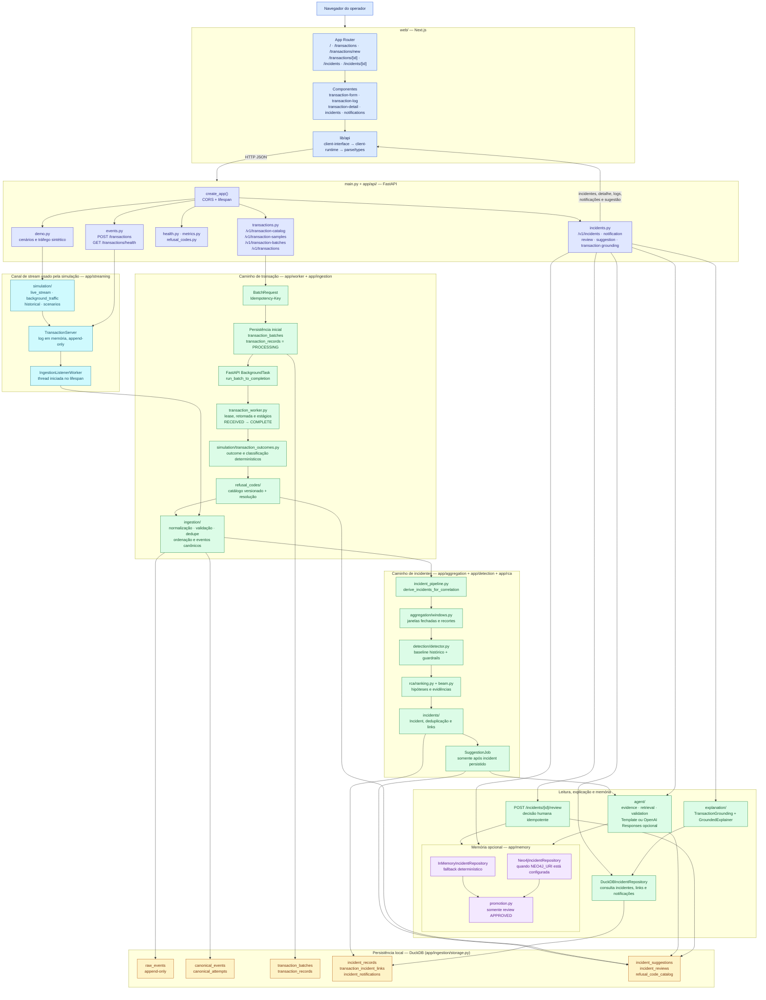

# Arquitetura do código — LumenPrep

Este é o diagrama da arquitetura que existe no repositório. Ele mostra os módulos, as
fronteiras de processo e os caminhos de dados do produto; não é um desenho de requisitos
do desafio.

## Como ler o desenho

- **Interface:** o diretório `web/` é um cliente Next.js. Ele não lê DuckDB nem Neo4j;
  usa os clientes tipados em `web/lib/api/` para chamar o FastAPI.
- **API e lifecycle:** `main.py` inicia o FastAPI, reconcilia trabalho pendente e sobe o
  listener de stream. A API de batch persiste primeiro e responde `202`; o worker avança
  a transação de forma durável.
- **Dados:** DuckDB é a fonte operacional de transações, eventos canônicos, incidentes,
  notificações, sugestões, revisões e catálogo de códigos. Parquet é usado pelo benchmark,
  não como o repositório transacional do fluxo online.
- **Incidentes:** o worker transforma resultados em eventos canônicos, calcula agregações,
  detecta anomalias, executa o RCA e só então persiste e relaciona o incidente.
- **Memória e agente:** ambos são complementares. Neo4j só é usado se estiver configurado;
  sem ele há fallback em memória. O agente recebe evidência de um incidente já persistido e
  devolve uma sugestão, sem executar ações externas.
- **Demo:** com `DEMO_MODE=true`, os endpoints de leitura de incidentes usam fixtures em
  `contracts/fixtures/`; com o modo desligado, leem `DuckDBIncidentRepository`.

## Referências no código

- [Entrada da aplicação](../main.py)
- [Rotas da API](../app/api)
- [Worker transacional](../app/worker/transaction_worker.py)
- [Pipeline de incidentes](../app/worker/incident_pipeline.py)
- [Persistência DuckDB](../app/ingestion/storage.py)
- [Cliente web](../web/lib/api)
