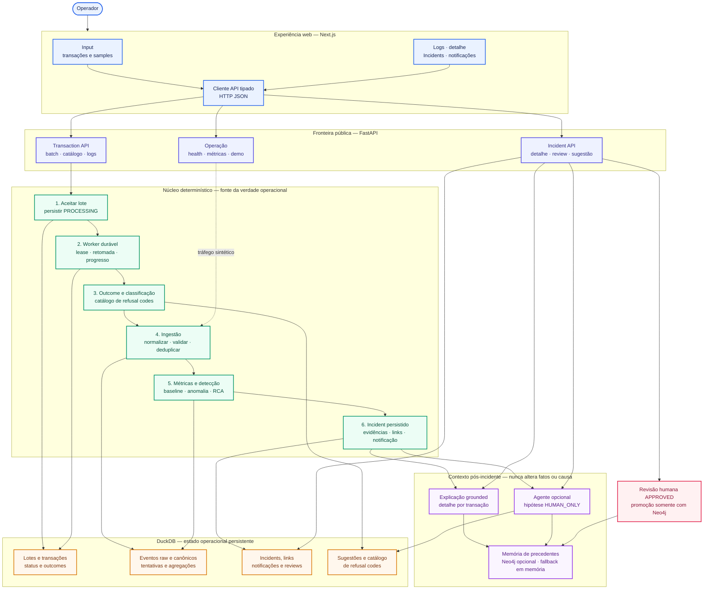

# Arquitetura de apresentação — LumenPrep

```mermaid
flowchart TB
    Operator([Operador]) --> Web
    subgraph Web["Experiência web — Next.js"]
        direction LR
        Input["Input<br/>transações e samples"] --> Client["Cliente API tipado<br/>HTTP JSON"]
        Observe["Logs · detalhe<br/>Incidents · notificações"] --> Client
    end
    subgraph API["Fronteira pública — FastAPI"]
        direction LR
        TxAPI["Transaction API<br/>batch · catálogo · logs"]
        IncAPI["Incident API<br/>detalhe · review · sugestão"]
        OpsAPI["Operação<br/>health · métricas · demo"]
    end
    Client --> TxAPI
    Client --> IncAPI
    Client --> OpsAPI
    subgraph Core["Núcleo determinístico — fonte da verdade operacional"]
        direction LR
        Accept["1. Aceitar lote<br/>persistir PROCESSING"] --> Worker["2. Worker durável<br/>lease · retomada · progresso"] --> Outcome["3. Outcome e classificação<br/>catálogo de refusal codes"] --> Ingest["4. Ingestão<br/>normalizar · validar · deduplicar"] --> Detect["5. Métricas e detecção<br/>baseline · anomalia · RCA"] --> Incident["6. Incident persistido<br/>evidências · links · notificação"]
    end
    TxAPI --> Accept
    OpsAPI -. tráfego sintético .-> Ingest
    subgraph Intelligence["Contexto pós-incidente — nunca altera fatos ou causa"]
        direction LR
        Explain["Explicação grounded<br/>detalhe por transação"] --> Memory["Memória de precedentes<br/>Neo4j opcional · fallback em memória"]
        Agent["Agente opcional<br/>hipótese HUMAN_ONLY"] --> Memory
    end
    Incident --> Explain
    Incident --> Agent
    IncAPI --> Explain
    IncAPI --> Agent
    Review["Revisão humana APPROVED<br/>promoção somente com Neo4j"]
    IncAPI --> Review --> Memory
    subgraph Data["DuckDB — estado operacional persistente"]
        direction LR
        TxData["Lotes e transações<br/>status e outcomes"]
        EventData["Eventos raw e canônicos<br/>tentativas e agregações"]
        IncData["Incidents, links<br/>notificações e reviews"]
        AssistData["Sugestões e catálogo<br/>de refusal codes"]
    end
    Accept --> TxData
    Worker --> TxData
    Ingest --> EventData
    Detect --> EventData
    Incident --> IncData
    Agent --> AssistData
    Outcome --> AssistData
    IncAPI --> IncData
    classDef ui fill:#eaf2ff,stroke:#2563eb,color:#172554,stroke-width:2px;
    classDef api fill:#eef2ff,stroke:#4f46e5,color:#312e81,stroke-width:2px;
    classDef core fill:#ecfdf5,stroke:#059669,color:#064e3b,stroke-width:2px;
    classDef data fill:#fff7ed,stroke:#d97706,color:#78350f,stroke-width:2px;
    classDef intel fill:#faf5ff,stroke:#9333ea,color:#581c87,stroke-width:2px;
    classDef human fill:#fff1f2,stroke:#e11d48,color:#881337,stroke-width:2px;
    class Operator,Input,Observe,Client ui;
    class TxAPI,IncAPI,OpsAPI api;
    class Accept,Worker,Outcome,Ingest,Detect,Incident core;
    class TxData,EventData,IncData,AssistData data;
    class Explain,Agent,Memory intel;
    class Review human;
```
