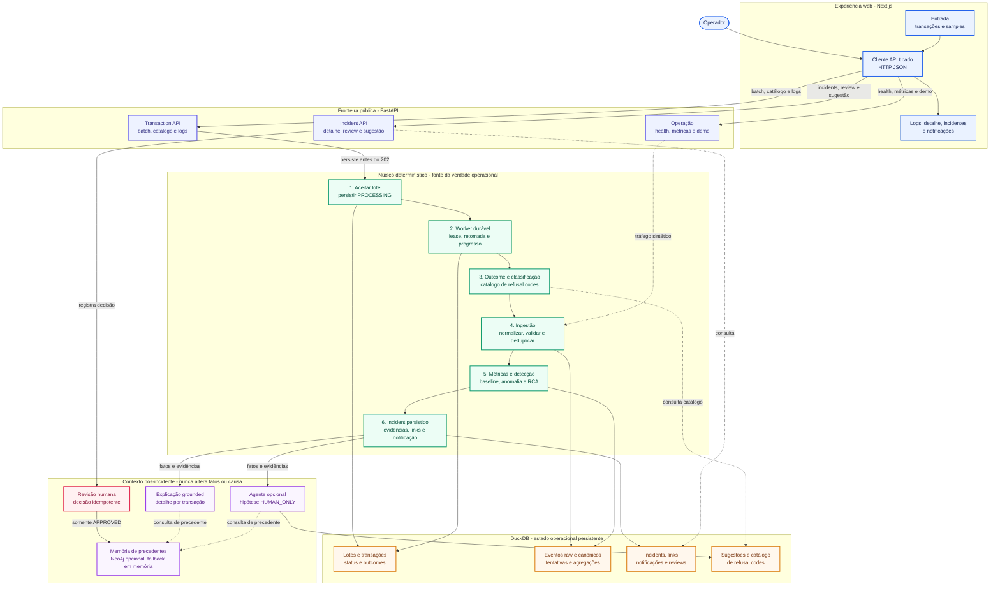

# Arquitetura de apresentação - LumenPrep

Este desenho é intencionalmente orientado ao fluxo operacional. Setas contínuas representam
processamento ou persistência; setas tracejadas representam consulta ou tráfego interno.

## Leitura do diagrama

- A UI é consumidora da API: não consulta DuckDB ou Neo4j diretamente.
- O lote é gravado como `PROCESSING` antes da resposta `202`; o worker pode retomar o trabalho.
- DuckDB guarda os fatos operacionais. Explicação, agente e memória apenas enriquecem a leitura pós-incidente.
- Neo4j é opcional e recebe um precedente somente depois de uma revisão humana `APPROVED`.
