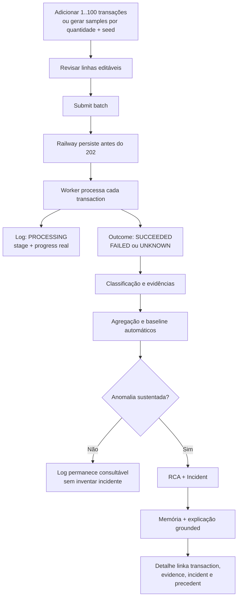
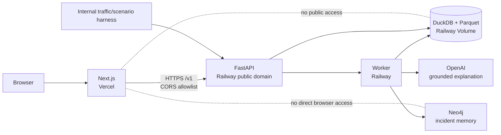
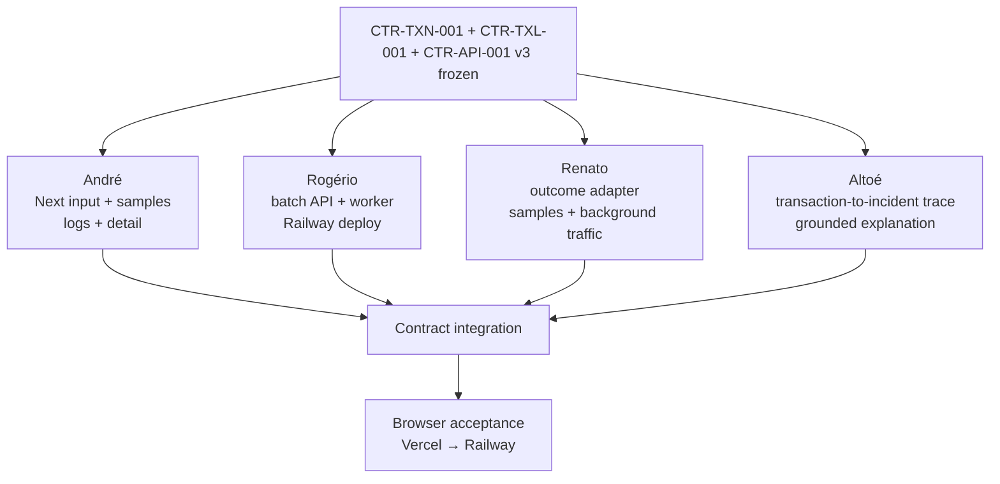
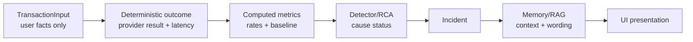

# Diagramas de arquitetura — Lumen 2.0

Fonte de verdade: `docs/plans/system-plan.md` v2.0.0.

## Fluxo do produto

## Deploy Vercel + Railway

## Lanes paralelas

## Autoridade dos dados

Cada etapa pode enriquecer a seguinte, mas nenhuma etapa posterior reescreve fatos anteriores. O navegador apresenta; não calcula outcome, taxa, causa ou confiança.
