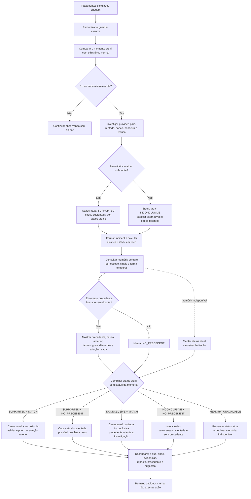
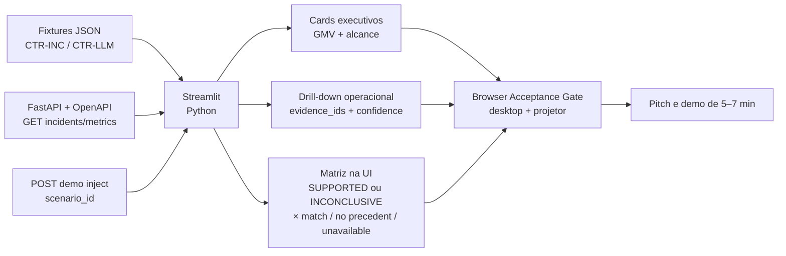
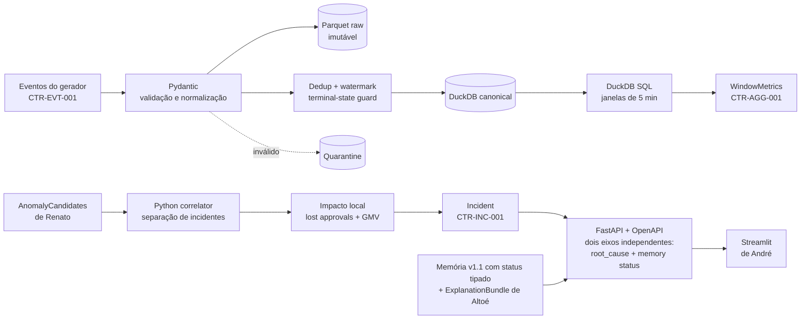
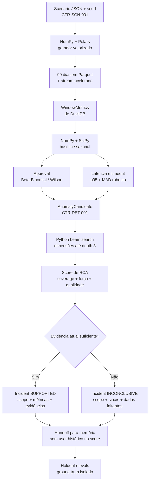

# Diagramas de arquitetura — Lumen

Fonte de verdade: `docs/plans/system-plan.md` v1.3.1. Estes diagramas são projeções explicativas; em caso de divergência, o plano geral vence.

## 1. Fluxo completo para público geral



## 2. André — frontend, demo e pitch



## 3. Gabriel Altoé — Neo4j, Graph RAG e explicação

```mermaid
flowchart TD
    A[Incident atual<br/>SUPPORTED ou INCONCLUSIVE<br/>CTR-INC-001] --> B[Neo4j Driver + Cypher<br/>prefilter por escopo e sinais]
    B --> C[Score estruturado<br/>escopo + declines + forma temporal]
    C --> D[Embedding opcional<br/>text-embedding-3-small]
    D --> E[SimilarIncidentResult v1.1<br/>memory_status tipado<br/>CTR-MEM-001]
    C --> E
    E --> F{Há match acima do threshold?}
    F -->|Sim| G[Precedente HUMAN_CONFIRMED<br/>fatores iguais e diferentes]
    F -->|Não| H[matches=[]<br/>NO_PRECEDENT]
    A --> I[Catálogo versionado<br/>de playbooks]
    G --> J[OpenAI Responses API<br/>gpt-5.6-terra + Structured Outputs]
    H --> J
    I --> J
    J --> K[Validador de evidence_ids<br/>+ precondições do playbook<br/>+ template determinístico]
    K --> L[ExplanationBundle<br/>precedente não altera causa atual<br/>sempre HUMAN_ONLY]
```

## 4. Rogério — ingestão, dados, contratos e API



## 5. Renato — geração, detecção e causa raiz


