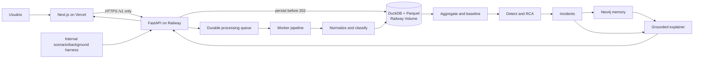

# Plano geral do sistema — Lumen

## 1. Controle do plano

- **Versão:** 2.1.1
- **Data:** 2026-08-29
- **Estado:** `PLAN READY`
- **Change class:** `MINOR`; preserva o frontend 2.1.0 e publica extensões aditivas compatíveis de `CTR-INC-001 v1`, sem alterar `CTR-API-001 v3`.
- **Fonte de verdade:** este arquivo; planos em `docs/plans/people/` são projeções.
- **Produto:** observabilidade e diagnóstico de pagamentos a partir de transações sintéticas inseridas pelo usuário ou emitidas pelo gerador interno.
- **Deploy:** Next.js na Vercel; FastAPI, worker e estado operacional no Railway.
- **Base implementada preservada:** runtime Python 3.14.4, Docker/Railway, ingestion, aggregation, detection, simulation, incidents, memory/explanation e API já presentes na `main` em 2026-08-29; a revisão 2.0 estende essa base.
- **Escopo desta publicação na `main`:** API/worker transaction-first, schemas e fixtures v3 estão implementados; `web/` é publicado como frontend compartilhado com mocks explícitos. Railway, Vercel, CORS e acceptance live continuam pendentes.
- **Changelog 2.0.0:** substitui o construtor público de efeitos por entrada de uma ou várias transações; métricas, outcomes, classificação e anomalias passam a ser derivados pelo backend; Streamlit vira protótipo/fallback; o gerador existente vira harness interno.
- **Changelog 2.0.1:** registra a implementação validada de histórico/stream mediado por servidor em `renato/tarefa44@602ae9d` como evidência do harness interno. Ela não implementa nem congela `CTR-TXN/TXL/API v3`; `TASK-DATA-009 / LUM2-62` deve adaptá-la à batch API comum antes de integração funcional.
- **Changelog 2.0.2:** integra `renato/tarefa44@602ae9d` na `main` como `CMP-HARNESS-001`; `CTR-TXN/TXL/API v3` continuam sendo a única fronteira pública planejada, e `LUM2-61/62` continuam responsáveis pelo adapter e tráfego de fundo compatíveis.
- **Changelog 2.1.0:** publica a pasta única `web/` com shell desktop/mobile, formulário, logs, detalhes e Incidents. O formulário consome a API v3; Logs, Detail e Incidents permanecem em fixtures explícitas até o adapter live de `LUM2-12`. Não confirma deploy/live acceptance.
- **Changelog 2.1.1:** integra `feat/OBJ-ROGERIO-001-platform-core` sobre o frontend 2.1.0, preservando `web/` e adicionando a `CTR-INC-001 v1` hipóteses causais ordenadas, classe de recomendação humana, priorização local por moeda e correlação por fingerprint causal exato. Não adiciona adapter live ao frontend nem altera `CTR-API-001 v3`.

## 2. Problema, usuário e critério de vitória

Operações de pagamentos precisa registrar transações, acompanhar o processamento e entender se cada uma funcionou ou falhou e por quê. O sistema deve ainda transformar o conjunto de logs em métricas, detectar degradações, investigar o menor slice causal e recuperar precedentes confirmados.

O MVP vence quando uma pessoa:

1. adiciona uma ou várias transações sem calcular métricas nem informar a resposta esperada;
2. recebe IDs duráveis e acompanha progresso real por transação;
3. filtra o log por `PROCESSING`, `SUCCEEDED`, `FAILED` ou `UNKNOWN`;
4. abre uma transação e vê input, outcome normalizado, classificação, evidências e incidentes relacionados;
5. observa approval rate, baseline, anomalias e explicações calculados automaticamente a partir dos logs.

### Fatos

- `FACT-001`: a entrada pública representa fatos de uma transação, não parâmetros de anomalia.
- `FACT-002`: o usuário pode submeter de 1 a 100 transações no mesmo lote ou pedir que o Railway gere inputs sintéticos válidos para preencher o lote.
- `FACT-003`: approval rate, payment conversion, latência, timeout share, baseline, impacto e causa são outputs do sistema.
- `FACT-004`: o frontend será publicado na Vercel e consumirá somente a API HTTPS do Railway.
- `FACT-005`: o backend deve persistir cada item antes de responder `202` e publicar seu próprio progresso.
- `FACT-006`: memória e RAG explicam incidentes derivados; não classificam cada transação bruta nem alteram fatos calculados.
- `FACT-007`: recomendações permanecem `HUMAN_ONLY`; o sistema não autoriza, reprocessa, roteia nem executa pagamentos.

### Hipóteses controladas

- `ASM-001`: André permanece owner do frontend; validada pelo protótipo entregue e pelo plano 2.0. Troca de owner exige change control.
- `ASM-002`: haverá OpenAI e Neo4j acessíveis; fallback por template/repositório local já existe e continua obrigatório.
- `ASM-003`: Python 3.14.4 e Docker estão disponíveis; ambiente e Dockerfile já foram validados na `main`.
- `ASM-004`: o MVP pode operar com um único serviço Railway e volume persistente para DuckDB/Parquet. Validar no primeiro deploy 2.0; se insuficiente, migrar o adapter para Railway Postgres sem mudar contratos públicos.
- `ASM-005`: polling a cada 1–2 segundos é suficiente para a demo. Se o teste de carga mostrar custo ou atraso excessivo, adicionar SSE depois da fatia básica.
- `ASM-006`: transações são integralmente sintéticas/tokenizadas. Se dados reais entrarem em escopo, autenticação, tenant isolation, PCI/PII e retenção exigem novo change control.

### Não objetivos

- aceitar PAN, CVV, nome, e-mail ou outra PII real;
- deixar o usuário informar approval rate, queda esperada, latency multiplier, decline esperado, causa ou ground truth;
- fazer checkout, autorização, captura, refund, retry ou rerouting reais;
- usar Neo4j como event store ou usar LLM para calcular métricas;
- publicar DuckDB, Neo4j, OpenAI ou Railway Volume diretamente para o navegador;
- concluir pitch antes da fatia funcional de frontend.

## 3. Experiência pública

### Shell desktop e mobile

- Sidebar esquerda compacta com `Input`, `Logs` e `Incidents`; hover ou foco visível expande rótulos sem sobrepor o conteúdo.
- Até 760 px, os mesmos destinos ficam em uma barra inferior fixa, com safe area e espaço reservado no conteúdo.

### `/transactions/new` — adicionar transações

- Uma linha inicial e controles `Add transaction`, `Duplicate` e `Remove`.
- O catálogo vem de `GET /v1/transaction-catalog`; nenhum option ID fica hardcoded.
- `Generate sample transactions` recebe quantidade de 1 a 100, chama `POST /v1/transaction-samples` e preenche linhas editáveis. Seed continua uma capacidade opcional da API, mas não é exposta como controle público. A resposta nunca inclui outcome, status, métricas, causa ou ground truth.
- Campos: referência opcional, timestamp opcional, merchant, provider, banco emissor, país, moeda, valor em unidade mínima, método, bandeira/tipo quando aplicáveis e conexão opcional.
- Um `Submit batch` envia de 1 a 100 itens com `Idempotency-Key`.
- A resposta `202` redireciona para `/transactions?batch_id=...`; erro preserva os dados digitados.

### `/transactions` — log vivo

- Tabela newest-first com status, progresso/etapa, valor, merchant, provider, banco, método e horário.
- Filtros por todos, sucesso, falha, processando e desconhecido; paginação por cursor.
- Polling somente enquanto houver item `PROCESSING`; a UI não inventa timers nem progresso.
- Loading, vazio, erro e stale state têm texto, ícone e contraste; cor nunca é o único sinal.
- Cada linha resume somente outcome, classificação, reason, confidence, evidence IDs e Incident retornados pelo backend; `FAILED` e `UNKNOWN` têm texto distinto.

### `/transactions/[transaction_id]` — detalhe

- Input imutável, lifecycle, outcome do provider, motivo normalizado e evidências.
- “Falha da transação” é diferente de `processing.failure_code`, que representa falha técnica da pipeline.
- Incidentes correlacionados apontam para `/incidents/[incident_id]`; o detalhe mostra a recommendation devolvida pelo Incident e um item isolado informa honestamente sua ausência.

### `/incidents` — diagnóstico agregado

- Preserva o dashboard de incidentes, métricas, causa atual, memória e recomendações humanas.
- Inclui uma fila de atenção técnica para `UNKNOWN`, sem fabricar `incident_id`, causa ou recommendation antes da correlação do backend.
- `SUPPORTED|INCONCLUSIVE` e `MATCH_FOUND|NO_PRECEDENT|MEMORY_UNAVAILABLE` continuam eixos independentes.

## 4. Decisões materiais

| ID | Estado | Decisão | Consequência | Flight Log |
| --- | --- | --- | --- | --- |
| DEC-001..012 | DECIDED | Mantêm modelagem Payment/Attempt/Event, detector estatístico, RCA, memória independente e agente read-only | detalhes preservados nos contratos v1 e entradas anteriores | `FL-20260829-TEAM-003`–`012` |
| DEC-013 | PARTIALLY SUPERSEDED | Hospedar FastAPI + Streamlit no Railway via Docker | FastAPI/Railway/Docker permanecem; frontend final muda para Vercel em DEC-016 | `FL-20260829-ROGERIO-001` |
| DEC-014 | DECIDED | Manter chaves de `Incident.scope` abertas até o RCA real estabilizar dimensões | convenção/testes protegem `provider_id`; revisar depois de RCA integrado | `FL-20260829-ROGERIO-002` |
| DEC-015 | DECIDED | Entrada pública transaction-first em batch, com sample generation por quantidade/seed; analytics e classificação automáticos | cria `CTR-TXN-001`, `CTR-TXL-001` e `CTR-API-001 v3` | `FL-20260829-TEAM-015` |
| DEC-016 | DECIDED | Next.js/Vercel consome uma única API FastAPI/Railway | Railway é data plane; CORS allowlist; sem acesso direto a stores | `FL-20260829-TEAM-016` |
| DEC-017 | DECIDED | Progresso é persistido pelo backend; preservar DuckDB/Volume e gerador como harness interno | polling honesto, uma réplica no MVP e mínimo retrabalho; adapter permite Postgres/SSE posterior | `FL-20260829-TEAM-017` |
| DEC-020 | DECIDED | Navegação usa três destinos e `UNKNOWN` entra na atenção técnica sem virar Incident por inferência da UI | preserva `CTR-TXL-001` e `CTR-INC-001` | `FL-20260829-TEAM-020` |
| DEC-021 | DECIDED | Publicar `web/` na main como superfície compartilhada de integração | elimina duplicação sem alegar readiness live | `FL-20260829-TEAM-021` |

## 5. Arquitetura 2.0



### Fronteiras de deploy

| Ambiente | Responsabilidade | Dados permitidos | Dados proibidos |
| --- | --- | --- | --- |
| Vercel | Next.js, rotas e rendering | contratos públicos da API | secrets de backend, SQL, Neo4j, ground truth |
| Railway web | FastAPI pública, validação, idempotência, queries | inputs sintéticos e respostas derivadas | PAN/CVV/PII |
| Railway worker | lifecycle, normalização, classificação, agregação/detecção | registros persistidos | request não persistido |
| Railway Volume | DuckDB/Parquet do MVP | raw sintético, canonical, métricas, incidentes | secrets |
| Neo4j | memória de incidentes confirmados | signatures, causa confirmada, playbook | transações completas |

O Railway web precisa de domínio público porque a Vercel não participa da rede privada Railway. `CORS_ALLOWED_ORIGINS` contém apenas os domínios Vercel de production/preview autorizados e localhost. Banco e volume não recebem domínio público. O Dockerfile e o runbook Railway já publicados são adaptados, não recriados.

### Lifecycle por transação

```text
RECEIVED → NORMALIZING → CLASSIFYING → AGGREGATING → ANALYZING → COMPLETE
                                                               ↘ PIPELINE_FAILED
```

- Status público: `PROCESSING`, `SUCCEEDED`, `FAILED`, `UNKNOWN`.
- `FAILED` é outcome da transação; `PIPELINE_FAILED` aparece em `processing.stage` com `failure_code` e não deve ser rotulado como decline.
- O worker grava estágio e progresso; terminal exige `progress_percent=100`.
- Retry usa o mesmo transaction ID e é idempotente; não duplica evento nem métrica.

## 6. Componentes e ownership

| ID | Componente | Owner | Entrada → saída | Mock/test |
| --- | --- | --- | --- | --- |
| CMP-WEB-001 | Next.js transaction input/log/detail/incidents | André | CTR-API → UI | transaction fixtures + browser gate |
| CMP-API-001 | FastAPI pública e CORS | Rogério | HTTP → contracts | OpenAPI + contract tests |
| CMP-TXN-001 | batch ingest, idempotência e lifecycle | Rogério | CTR-TXN → CTR-TXL/EVT | batch/list fixtures |
| CMP-DATA-001 | outcome simulator e background harness | Renato | TransactionInput → provider outcome/events | seeded fixtures |
| CMP-ING-001 | normalization/dedupe/quarantine | Rogério | events → canonical | existing canonical fixtures |
| CMP-AGG-001 | janelas e métricas automáticas | Rogério | canonical → CTR-AGG | known-denominator tests |
| CMP-DET/RCA-001 | baseline, anomalia e causa | Renato | CTR-AGG → CTR-DET | holdout/evals |
| CMP-INC-001 | incidentes e impacto | Rogério | candidates → CTR-INC | incident fixtures |
| CMP-MEM/EXP-001 | memória e explicação grounded | Altoé | CTR-INC → CTR-MEM/LLM | RAG eval matrix |
| CMP-HARNESS-001 | cenários e tráfego interno | Renato | internal config → batch API | existing scenario fixtures |
| CMP-DEPLOY-001 | Railway runtime/volume/env | Rogério | repo/env → health | deploy smoke |

Hotspots: Rogério coordena `contracts/v1/`, OpenAPI, DuckDB migrations, dependency lock e env; André coordena `web/`; Renato coordena simulator/detector; Altoé coordena graph/prompts. Mudança de contrato começa aqui.

## 7. Catálogo de contratos

| ID/versão | Estado | Produtor → consumidores | Propósito | Erros/fallback | Evidência |
| --- | --- | --- | --- | --- | --- |
| CTR-TXN-001 v1 | FROZEN / IMPLEMENTED ON MAIN | WEB ↔ API/TXN/DATA | catálogo, sample generation e batch 1..100 sem outcome/métricas | `422`, `409`, `503`; idempotência e seed | endpoints, schemas e fixtures em `origin/main@103073b`; smoke Railway pendente |
| CTR-TXL-001 v1 | FROZEN / IMPLEMENTED ON MAIN | TXN/worker → API/WEB | record/list, lifecycle, outcome e classificação | stale/unknown explícitos | worker, schemas e fixtures em `origin/main@103073b`; smoke Railway pendente |
| CTR-API-001 v3 | FROZEN / IMPLEMENTED ON MAIN | API → WEB | health, batch, logs, detail, metrics e incidents | timeout e códigos tipados | endpoints e OpenAPI em `origin/main@103073b`; CORS/deploy pendentes |
| CTR-TDI-001 v1 | IMPLEMENTED / READY FOR REVIEW | API → WEB | detalhe grounded de uma transação e seus Incidents autorizados | `404` para transação inexistente; `NO_INCIDENT` e `PARTIAL` explícitos | schema, fixture, OpenAPI e testes HTTP na branch `codex/integrate-grounded-transactions` |
| CTR-SCN-001 v2 | INTERNAL MIGRATION PENDING | DATA/HARNESS → DATA | injeção e ground truth apenas para teste | nunca exposto na UI pública | scenario draft `cc24c7a`; código atual será adaptado pelo harness |
| CTR-EVT-001 v1 | FROZEN | DATA/TXN → ING | canonical payment attempt event | quarantine/dedupe/watermark | schema existente |
| CTR-AGG-001 v1 | FROZEN | AGG → DET/RCA | métricas calculadas | `INSUFFICIENT_VOLUME` | schema existente |
| CTR-DET-001 v1 | FROZEN | DET → INC | candidatos numéricos | `NO_ANOMALY`, data quality | schema existente |
| CTR-INC-001 v1 | FROZEN, adendo 2.1.1 | INC → MEM/EXP/API/WEB | incidente auditável com hipóteses alternativas, recomendação e impacto local priorizável | `INCONCLUSIVE` válido; moedas não recebem conversão implícita | fixtures existentes + testes de serialização/prioridade/correlação |
| CTR-MEM-001 v1.1 | FROZEN | MEM → EXP/API | precedente tipado | `NO_PRECEDENT`, `MEMORY_UNAVAILABLE` | fixtures existentes |
| CTR-LLM-001 v1 | FROZEN | EXP → API/WEB | explicação grounded | template determinístico | schema existente |
| CTR-DEP-001 v1 | FROZEN | Railway/Vercel → team | URLs, env, health e CORS | local mode; no fake live | deployment plan |

### Invariantes

- Todo `202` corresponde a batch e transações já persistidos.
- `Idempotency-Key` repetida com payload igual retorna os mesmos IDs; com payload diferente retorna `409`.
- Batch é aceito atomicamente no MVP: nenhum item é aceito se o request falhar na validação ou persistência inicial.
- IDs são opacos; timestamps UTC; dinheiro em `amount_minor`; taxas 0..1.
- Input nunca contém status, decline, approval rate, efeito, causa ou ground truth.
- Sample generation devolve somente TransactionInput, usa catálogo vigente e retorna a seed efetiva; gerar não persiste nem processa até `Submit batch`.
- Outcome determinístico precede classificação; LLM não decide sucesso/falha nem calcula métricas.
- RAG recebe somente Incident já derivado e não é chamado por transação individual.
- `GET /v1/incidents` sempre devolve uma lista homogênea de `Incident`; quando filtrada por `transaction_id`, a lista só contém Incidents que passam por ID relacionado, evidência de classificação e `correlation_id` compatível.
- `GET /v1/transactions/{transaction_id}/incidents` é o único detalhe grounded público: devolve `RESOLVED`, `PARTIAL` ou `NO_INCIDENT`, evidência autorizada, Incident, memória, ExplanationBundle e limitações sem promover precedente a causa atual.
- `root_cause.alternatives` é uma lista ordenada por confiança decrescente; cada item é hipótese, não causa atual, e não altera `root_cause.status`.
- `recommendation_class` só classifica a recomendação humana (`INVESTIGATE`, `MONITOR` ou `ESCALATE`); `execution` permanece obrigatoriamente `HUMAN_ONLY`.
- Incidentes são ordenados por `impact.amount_minor` apenas dentro do bucket da mesma `currency`; sem FX versionado não há comparação global entre moedas.
- Candidatos só compartilham Incident quando `correlation_id`, janela sobreposta e fingerprint completo de `slice` coincidem; similaridade parcial de escopo não é suficiente.
- UI consome exclusivamente `NEXT_PUBLIC_API_BASE_URL`; não possui credencial de banco/agent.

## 8. Persistência, processamento e segurança

- Raw sintético é append-only; canonical registra versionamento e referência ao raw.
- DuckDB/Parquet ficam em path montado pelo Railway Volume. O MVP usa uma réplica; essa limitação é aceita e documentada.
- O estado durável de cada job permite retomar itens `PROCESSING` após restart. Itens presos recebem reconciliação por lease/updated_at.
- Logs técnicos não contêm payload completo nem metadata sensível.
- Nenhum PAN/CVV/PII é aceito; validação usa allowlist de campos e `additionalProperties=false`.
- Agente, RAG e playbooks são read-only e `HUMAN_ONLY`.
- Secrets apenas em Railway/Vercel environment variables; somente a base URL é pública.

## 9. Trabalho por pessoa

### André — frontend

Preservar `TASK-UI-001` concluída como protótipo Streamlit. Replanejar tarefas abertas: `TASK-UI-002` vira fundação Next/Vercel e formulário multi-input, incluindo geração de samples por quantidade/seed; `TASK-UI-003` vira log/filter/progress/detail; `TASK-UI-004` integra incidentes/recorrência; `TASK-UI-005` implementa adapter Railway e estados; `TASK-UI-006` faz acceptance e deploy Vercel. Pitch permanece depois do sistema.

### Rogério — backend/deploy

Preservar tarefas concluídas. Replanejar API aberta para batch ingest/list/detail, lifecycle durável e Railway. `TASK-API-003` deixa de publicar cenários e passa a publicar transactions; `TASK-INT-001/002` incorporam worker, CORS, volume, contract smoke e deploy.

### Renato — simulator/detector

Preservar gerador, métricas e detector. `TASK-DATA-006` concluída vira base do harness interno; `TASK-DATA-007` mantém ground truth isolado. A implementação validada em `renato/tarefa44@602ae9d` acrescenta geração histórica reprodutível com sazonalidade, baixa amostra e publicação mediada por servidor, mas usa a fronteira anterior e permanece referência interna. Trabalho novo: transformar cada TransactionInput em outcome/evento determinístico e adaptar esse harness para enviar tráfego de fundo pela mesma batch API.

### Altoé — memória/explicação

Preservar grafo/RAG. Não adicionar RAG por transação. Atualizar explanation para aceitar incidentes correlacionados a transaction IDs e garantir que o detalhe linkado nunca trate precedente como causa atual.

Os detalhes e microtarefas estão em `docs/plans/people/*.md`; a sincronização Linear 2.0 foi concluída e auditada em `docs/plans/linear-preview.md` (`LUM2-58`–`64` para o trabalho novo).

## 10. Ordem e paralelismo

```text
CTR-TXN/TXL/API v3
 ├─ André: Next shell + fixtures → input → logs/detail → live adapter
 ├─ Rogério: batch API → durable lifecycle → list/detail → Railway deploy
 ├─ Renato: deterministic outcome adapter → background harness → detector evals
 └─ Altoé: transaction-to-incident trace → grounded detail integration
                                      ↓
                         contract smoke + Vercel acceptance
```

Checkpoints:

1. **Contracts:** schemas/fixtures/OpenAPI validados.
2. **Primeira fatia:** um item enviado no Next aparece `PROCESSING` e termina no log.
3. **Batch:** pelo menos três itens mistos preservam ordem, IDs e filtros.
4. **Analytics:** logs alteram métricas e podem produzir incidente relacionado.
5. **Deploy:** Vercel → Railway ao vivo, restart do worker e fallback honesto.

## 11. Testes e acceptance

- Schema validation para todos os fixtures e refs.
- Contract tests: samples com seed reproduzível e valores do catálogo; batch 1/100/101; idempotência igual/conflitante; catalog e cursor.
- Worker: restart, duplicate delivery, stage monotonicity, terminal outcome e pipeline failure.
- Analytics: denominadores conhecidos; um batch misto altera métricas sem input manual.
- RAG: transaction link não muda autoridade do Incident; injection/no-answer/memory down.
- Browser: adicionar/remover/duplicar linhas; teclado; erro preserva input; filtros; progress real; detail; refresh; API down; viewport de demo; console/rede.
- Deploy smoke: health Railway, CORS Vercel production/preview permitido e origem alheia negada.

## 12. Riscos e contingências

| ID | Risco | Mitigação/fallback | Owner |
| --- | --- | --- | --- |
| RSK-009 | DuckDB com volume impede replicas e pode pausar no deploy | uma réplica aceita no MVP; adapter preparado para Postgres | Rogério |
| RSK-010 | Vercel bloqueada por CORS/env incorreta | allowlist e smoke por ambiente; mostrar `BACKEND UNAVAILABLE` | Rogério + André |
| RSK-011 | progresso falso ou regressivo | backend é autoridade; teste monotônico; UI nunca incrementa localmente | Rogério + André |
| RSK-012 | batch parcial gera logs inconsistentes | persistência inicial atômica; idempotência | Rogério |
| RSK-013 | poucos inputs não sustentam anomalia | tráfego de fundo interno e `INCONCLUSIVE`; nunca inventar taxa | Renato |
| RSK-014 | novo frontend duplica regras do backend | catálogo/contratos e zero SQL/cálculo causal na UI | André |
| RSK-015 | dados reais entram na demo | copy “synthetic only”, allowlist e rejeição de PII/PAN/CVV | todos |

## 13. Parecer do Integration Contract Guardian — PLANNING

**Resultado: `PLAN READY`.**

- Produtores, consumidores, owners, versões, fixtures, erros e fallbacks estão definidos.
- O grafo é acíclico e permite quatro lanes paralelas após o freeze de `CTR-TXN/TXL/API`.
- O trabalho concluído não é apagado: Streamlit vira referência/fallback e o cenário v2 vira harness interno.
- A incompatibilidade pública é deliberadamente versionada em `CTR-API-001 v3`; não existe adapter silencioso para endpoints `/demo/scenarios`.
- A fatia ponta a ponta precede polimento, RAG adicional ou pitch.
- Linear está sincronizado com a revisão 2.0; issues concluídas foram preservadas e novas necessidades receberam novos IDs.
- **Integração da branch:** `web/` foi publicada na main como superfície de integração. Continua `NOT READY FOR LIVE ACCEPTANCE`: a próxima fatia é conectar logs/detail/incidents ao Railway, validar CORS/Vercel e executar browser acceptance permitido antes de marcar tarefas live como concluídas.

## 14. Fontes operacionais

- Railway FastAPI: https://docs.railway.com/guides/fastapi
- Railway Volumes: https://docs.railway.com/volumes/reference
- Railway Postgres: https://docs.railway.com/databases/postgresql
- Railway networking: https://docs.railway.com/networking/private-networking
- Next.js on Vercel: https://vercel.com/docs/frameworks/full-stack/nextjs
- Vercel environments: https://vercel.com/docs/deployments/environments
