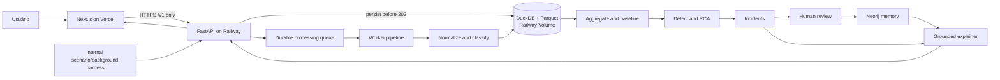

# Plano geral do sistema — Lumen

## 1. Controle do plano

- **Versão:** 2.4.4
- **Data:** 2026-08-30
- **Estado:** `PLAN READY`
- **Change class:** `CHANGE CONTROL`; adiciona `CTR-MEM-PROMOTE-001 v1` e o path compatível `POST /v1/incidents/{incident_id}/confirmation` a `CTR-API-001 v3.1`, sem alterar `CTR-INC-001 v1`.
- **Fonte de verdade:** este arquivo; planos em `docs/plans/people/` são projeções.
- **Produto:** observabilidade e diagnóstico de pagamentos a partir de transações sintéticas inseridas pelo usuário ou emitidas pelo gerador interno.
- **Deploy:** Next.js na Vercel; FastAPI, worker e estado operacional no Railway.
- **Base implementada preservada:** runtime Python 3.14.4, Docker/Railway, ingestion, aggregation, detection, simulation, incidents, memory/explanation e API já presentes na `main` em 2026-08-29; a revisão 2.0 estende essa base.
- **Escopo desta integração:** API/worker transaction-first e `web/` estão conectados pelo client live, com mocks apenas em modo explícito. Railway, Vercel, CORS e acceptance deployed continuam pendentes até prova no ambiente real.
- **Changelog 2.0.0:** substitui o construtor público de efeitos por entrada de uma ou várias transações; métricas, outcomes, classificação e anomalias passam a ser derivados pelo backend; Streamlit vira protótipo/fallback; o gerador existente vira harness interno.
- **Changelog 2.0.1:** registra a implementação validada de histórico/stream mediado por servidor em `renato/tarefa44@602ae9d` como evidência do harness interno. Ela não implementa nem congela `CTR-TXN/TXL/API v3`; `TASK-DATA-009 / LUM2-62` deve adaptá-la à batch API comum antes de integração funcional.
- **Changelog 2.0.2:** integra `renato/tarefa44@602ae9d` na `main` como `CMP-HARNESS-001`; `CTR-TXN/TXL/API v3` continuam sendo a única fronteira pública planejada, e `LUM2-61/62` continuam responsáveis pelo adapter e tráfego de fundo compatíveis.
- **Changelog 2.1.0:** publica a pasta única `web/` com shell desktop/mobile, formulário, logs, detalhes e Incidents. O formulário consome a API v3; Logs, Detail e Incidents permanecem em fixtures explícitas até o adapter live de `LUM2-12`. Não confirma deploy/live acceptance.
- **Changelog 2.1.1:** integra `feat/OBJ-ROGERIO-001-platform-core` sobre o frontend 2.1.0, preservando `web/` e adicionando a `CTR-INC-001 v1` hipóteses causais ordenadas, classe de recomendação humana, priorização local por moeda e correlação por fingerprint causal exato. Não adiciona adapter live ao frontend nem altera `CTR-API-001 v3`.
- **Changelog 2.2.0:** replaneja a recuperação de integração a partir de `main@613df52`, depois de confirmar que os incrementos de Neo4j, RCA, grounding e Parquet já estão na base. A execução restante é concentrada em duas lanes: Rogério integra core/dados/backend; André integra produto/deploy web. Nenhum contrato público recebe nova versão nesta revisão; o objetivo é tornar real a cadeia já contratada.
- **Changelog 2.2.1:** integra as duas lanes sobre `main@23b9061`: o frontend deixa de usar fixtures no runtime live e consome batch/log/detail/Incidents reais; o pipeline terminal passa a ser atômico no DuckDB, inclui a transação gatilho no vínculo de Incident e isola janelas por correlação/moeda; o Docker usa `uv.lock` congelado com o extra Neo4j e inclui a configuração do simulator. Contratos públicos permanecem congelados. Deploy e acceptance online continuam condicionados à evidência real.
- **Changelog 2.3.0:** corrige a lacuna descoberta em `main@404c23b`: a análise atual só preserva provider, país e moeda. Esta revisão planeja a migração para diagnóstico real nas seis dimensões do enunciado, com catálogo maior de entradas sintéticas e mudança de contrato coordenada. Linear não foi alterado.
- **Changelog 2.4.0:** inicia o desenho de um agente proativo de diagnóstico. O agente recebe fatos já calculados pelo motor, pode propor hipóteses para investigação mesmo sem precedente no RAG e nunca promove, executa ou altera uma causa/pagamento. A implementação permanece bloqueada até fechar taxonomia de fraude, corpus e critérios de evidência.
- **Changelog 2.4.1:** diante de sete horas restantes de hackathon, congela o escopo de demo em uma fatia vertical: stream sintético contínuo, duas degradações simultâneas, diagnóstico causal/evidência, recomendação humana e trial by fire. Integração real Yuno e RAG/agente amplo saem do caminho crítico.
- **Changelog 2.4.2:** torna a primeira etapa da demo reproduzível por `CTR-DEMO-001 v1`: um endpoint restrito a `DEMO_MODE` semeia janelas temporais de baseline pelo stream interno. Não recebe payload Yuno nem altera a entrada pública de transações.
- **Changelog 2.4.3:** congela a fatia implementada do agente proativo em `CTR-AGT-001`–`003 v1`: EvidencePack imutável, recuperação somente da memória/playbooks já autorizados, sugestão `HUMAN_ONLY` separada de `CTR-INC-001` e cliente determinístico padrão. O caminho OpenAI é opt-in e não integra a demo crítica.
- **Changelog 2.4.4:** fecha a captura explícita de revisão humana para memória: `POST /v1/incidents/{incident_id}/confirmation` só promove um Incident já persistido após receber revisão com identidade declarada, causa, playbook, perfil temporal e evidências existentes. Falha ou ausência do Neo4j responde erro; não há fallback em memória local apresentado como confirmação. Autenticação de produção do revisor continua fora do MVP sintético.
- **Changelog 2.3.1:** adiciona `CMP-QA-001`, um avaliador local do case. O modelo OpenAI seleciona apenas probes allowlisted contra uma instância isolada em memória e redige o parecer; não recebe ferramentas abertas, dados reais ou rota pública.
- **Changelog 2.3.2:** torna `CMP-QA-001` um auditor de proveniência de erro. O parecer não pode aprovar se a falha exibida não for reconstruível a partir do input, do adaptador sintético determinístico e dos eventos bruto/canônico persistidos, ou se a serialização da mesma entrada mudar o resultado.

## 2. Problema, usuário e critério de vitória

Operações de pagamentos precisa registrar transações, acompanhar o processamento e entender se cada uma funcionou ou falhou e por quê. O sistema deve ainda transformar o conjunto de logs em métricas, detectar degradações, investigar o menor slice causal e recuperar precedentes confirmados.

O MVP vence quando uma pessoa:

1. adiciona uma ou várias transações sem calcular métricas nem informar a resposta esperada;
2. recebe IDs duráveis e acompanha progresso real por transação;
3. filtra o log por `PROCESSING`, `SUCCEEDED`, `FAILED` ou `UNKNOWN`;
4. abre uma transação e vê input, outcome normalizado, classificação, evidências e incidentes relacionados;
5. observa approval rate, baseline, anomalias e explicações calculados automaticamente a partir dos logs.

### Fatos

- `FACT-001`: a entrada pública representa fatos de uma transação, não parâmetros de anomalia.
- `FACT-002`: o usuário pode submeter de 1 a 100 transações no mesmo lote ou pedir que o Railway gere inputs sintéticos válidos para preencher o lote.
- `FACT-003`: approval rate, payment conversion, latência, timeout share, baseline, impacto e causa são outputs do sistema.
- `FACT-004`: o frontend será publicado na Vercel e consumirá somente a API HTTPS do Railway.
- `FACT-005`: o backend deve persistir cada item antes de responder `202` e publicar seu próprio progresso.
- `FACT-006`: memória e RAG explicam incidentes derivados; não classificam cada transação bruta nem alteram fatos calculados.
- `FACT-007`: recomendações permanecem `HUMAN_ONLY`; o sistema não autoriza, reprocessa, roteia nem executa pagamentos.

### Hipóteses controladas

- `ASM-001`: André permanece owner do frontend; validada pelo protótipo entregue e pelo plano 2.0. Troca de owner exige change control.
- `ASM-002`: haverá OpenAI e Neo4j acessíveis; fallback por template/repositório local já existe e continua obrigatório.
- `ASM-003`: Python 3.14.4 e Docker estão disponíveis; ambiente e Dockerfile já foram validados na `main`.
- `ASM-004`: o MVP pode operar com um único serviço Railway e volume persistente para DuckDB/Parquet. Validar no primeiro deploy 2.0; se insuficiente, migrar o adapter para Railway Postgres sem mudar contratos públicos.
- `ASM-005`: polling a cada 1–2 segundos é suficiente para a demo. Se o teste de carga mostrar custo ou atraso excessivo, adicionar SSE depois da fatia básica.
- `ASM-006`: transações são integralmente sintéticas/tokenizadas. Se dados reais entrarem em escopo, autenticação, tenant isolation, PCI/PII e retenção exigem novo change control.

### Não objetivos

- aceitar PAN, CVV, nome, e-mail ou outra PII real;
- deixar o usuário informar approval rate, queda esperada, latency multiplier, decline esperado, causa ou ground truth;
- fazer checkout, autorização, captura, refund, retry ou rerouting reais;
- usar Neo4j como event store ou usar LLM para calcular métricas;
- publicar DuckDB, Neo4j, OpenAI ou Railway Volume diretamente para o navegador;
- concluir pitch antes da fatia funcional de frontend.

## 3. Experiência pública

### Shell desktop e mobile

- Sidebar esquerda compacta com `Input`, `Logs` e `Incidents`; hover ou foco visível expande rótulos sem sobrepor o conteúdo.
- Até 760 px, os mesmos destinos ficam em uma barra inferior fixa, com safe area e espaço reservado no conteúdo.

### `/transactions/new` — adicionar transações

- Uma linha inicial e controles `Add transaction`, `Duplicate` e `Remove`.
- O catálogo vem de `GET /v1/transaction-catalog`; nenhum option ID fica hardcoded.
- `Generate sample transactions` recebe quantidade de 1 a 100, chama `POST /v1/transaction-samples` e preenche linhas editáveis. Seed continua uma capacidade opcional da API, mas não é exposta como controle público. A resposta nunca inclui outcome, status, métricas, causa ou ground truth.
- Campos: referência opcional, timestamp opcional, merchant, provider, banco emissor, país, moeda, valor em unidade mínima, método, bandeira/tipo quando aplicáveis e conexão opcional.
- Um `Submit batch` envia de 1 a 100 itens com `Idempotency-Key`.
- A resposta `202` redireciona para `/transactions?batch_id=...`; erro preserva os dados digitados.

### `/transactions` — log vivo

- Tabela newest-first com status, progresso/etapa, valor, merchant, provider, banco, método e horário.
- Filtros por todos, sucesso, falha, processando e desconhecido; paginação por cursor.
- Polling somente enquanto houver item `PROCESSING`; a UI não inventa timers nem progresso.
- Loading, vazio, erro e stale state têm texto, ícone e contraste; cor nunca é o único sinal.
- Cada linha resume somente outcome, classificação, reason, confidence, evidence IDs e Incident retornados pelo backend; `FAILED` e `UNKNOWN` têm texto distinto.

### `/transactions/[transaction_id]` — detalhe

- Input imutável, lifecycle, outcome do provider, motivo normalizado e evidências.
- “Falha da transação” é diferente de `processing.failure_code`, que representa falha técnica da pipeline.
- Incidentes correlacionados apontam para `/incidents/[incident_id]`; o detalhe mostra a recommendation devolvida pelo Incident e um item isolado informa honestamente sua ausência.

### `/incidents` — diagnóstico agregado

- Preserva o dashboard de incidentes, métricas, causa atual, memória e recomendações humanas.
- Inclui uma fila de atenção técnica para `UNKNOWN`, sem fabricar `incident_id`, causa ou recommendation antes da correlação do backend.
- `SUPPORTED|INCONCLUSIVE` e `MATCH_FOUND|NO_PRECEDENT|MEMORY_UNAVAILABLE` continuam eixos independentes.

## 4. Decisões materiais

| ID | Estado | Decisão | Consequência | Flight Log |
| --- | --- | --- | --- | --- |
| DEC-001..012 | DECIDED | Mantêm modelagem Payment/Attempt/Event, detector estatístico, RCA, memória independente e agente read-only | detalhes preservados nos contratos v1 e entradas anteriores | `FL-20260829-TEAM-003`–`012` |
| DEC-013 | PARTIALLY SUPERSEDED | Hospedar FastAPI + Streamlit no Railway via Docker | FastAPI/Railway/Docker permanecem; frontend final muda para Vercel em DEC-016 | `FL-20260829-ROGERIO-001` |
| DEC-014 | DECIDED | Manter chaves de `Incident.scope` abertas até o RCA real estabilizar dimensões | convenção/testes protegem `provider_id`; revisar depois de RCA integrado | `FL-20260829-ROGERIO-002` |
| DEC-015 | DECIDED | Entrada pública transaction-first em batch, com sample generation por quantidade/seed; analytics e classificação automáticos | cria `CTR-TXN-001`, `CTR-TXL-001` e `CTR-API-001 v3` | `FL-20260829-TEAM-015` |
| DEC-016 | DECIDED | Next.js/Vercel consome uma única API FastAPI/Railway | Railway é data plane; CORS allowlist; sem acesso direto a stores | `FL-20260829-TEAM-016` |
| DEC-017 | DECIDED | Progresso é persistido pelo backend; preservar DuckDB/Volume e gerador como harness interno | polling honesto, uma réplica no MVP e mínimo retrabalho; adapter permite Postgres/SSE posterior | `FL-20260829-TEAM-017` |
| DEC-020 | DECIDED | Navegação usa três destinos e `UNKNOWN` entra na atenção técnica sem virar Incident por inferência da UI | preserva `CTR-TXL-001` e `CTR-INC-001` | `FL-20260829-TEAM-020` |
| DEC-021 | DECIDED | Publicar `web/` na main como superfície compartilhada de integração | elimina duplicação sem alegar readiness live | `FL-20260829-TEAM-021` |
| DEC-030 | DECIDED | Exigir revisão humana explícita antes de promover Incident atual ao Neo4j | adiciona `CTR-MEM-PROMOTE-001 v1` e path aditivo; não altera causa atual | `FL-20260830-TEAM-034` |

## 5. Arquitetura 2.0



### Fronteiras de deploy

| Ambiente | Responsabilidade | Dados permitidos | Dados proibidos |
| --- | --- | --- | --- |
| Vercel | Next.js, rotas e rendering | contratos públicos da API | secrets de backend, SQL, Neo4j, ground truth |
| Railway web | FastAPI pública, validação, idempotência, queries | inputs sintéticos e respostas derivadas | PAN/CVV/PII |
| Railway worker | lifecycle, normalização, classificação, agregação/detecção | registros persistidos | request não persistido |
| Railway Volume | DuckDB/Parquet do MVP | raw sintético, canonical, métricas, incidentes | secrets |
| Neo4j | memória de incidentes confirmados | signatures, causa confirmada, playbook | transações completas |

O Railway web precisa de domínio público porque a Vercel não participa da rede privada Railway. `CORS_ALLOWED_ORIGINS` contém apenas os domínios Vercel de production/preview autorizados e localhost. Banco e volume não recebem domínio público. O Dockerfile e o runbook Railway já publicados são adaptados, não recriados.

### Lifecycle por transação

```text
RECEIVED → NORMALIZING → CLASSIFYING → AGGREGATING → ANALYZING → COMPLETE
                                                               ↘ PIPELINE_FAILED
```

- Status público: `PROCESSING`, `SUCCEEDED`, `FAILED`, `UNKNOWN`.
- `FAILED` é outcome da transação; `PIPELINE_FAILED` aparece em `processing.stage` com `failure_code` e não deve ser rotulado como decline.
- O worker grava estágio e progresso; terminal exige `progress_percent=100`.
- Retry usa o mesmo transaction ID e é idempotente; não duplica evento nem métrica.

## 6. Componentes e ownership

| ID | Componente | Owner | Entrada → saída | Mock/test |
| --- | --- | --- | --- | --- |
| CMP-WEB-001 | Next.js transaction input/log/detail/incidents | André | CTR-API → UI | transaction fixtures + browser gate |
| CMP-API-001 | FastAPI pública e CORS | Rogério | HTTP → contracts | OpenAPI + contract tests |
| CMP-TXN-001 | batch ingest, idempotência e lifecycle | Rogério | CTR-TXN → CTR-TXL/EVT | batch/list fixtures |
| CMP-DATA-001 | outcome simulator e background harness | Renato | TransactionInput → provider outcome/events | seeded fixtures |
| CMP-ING-001 | normalization/dedupe/quarantine | Rogério | events → canonical | existing canonical fixtures |
| CMP-AGG-001 | janelas e métricas automáticas | Rogério | canonical → CTR-AGG | known-denominator tests |
| CMP-DET/RCA-001 | baseline, anomalia e causa | Renato | CTR-AGG → CTR-DET | holdout/evals |
| CMP-INC-001 | incidentes e impacto | Rogério | candidates → CTR-INC | incident fixtures |
| CMP-MEM/EXP-001 | memória e explicação grounded | Altoé | CTR-INC → CTR-MEM/LLM | RAG eval matrix |
| CMP-HARNESS-001 | cenários e tráfego interno | Renato | internal config → batch API | existing scenario fixtures |
| CMP-DEPLOY-001 | Railway runtime/volume/env | Rogério | repo/env → health | deploy smoke |
| CMP-QA-001 | avaliador local e auditor de proveniência | Team | `avaliacao.md` + API local → parecer e evidências | oráculos de grounding + reconstrução de erro + equivalência de transporte |

Hotspots: Rogério coordena `contracts/v1/`, OpenAPI, DuckDB migrations, dependency lock e env; André coordena `web/`; Renato coordena simulator/detector; Altoé coordena graph/prompts. Mudança de contrato começa aqui.

## 7. Catálogo de contratos

| ID/versão | Estado | Produtor → consumidores | Propósito | Erros/fallback | Evidência |
| --- | --- | --- | --- | --- | --- |
| CTR-TXN-001 v1 | FROZEN / IMPLEMENTED ON MAIN | WEB ↔ API/TXN/DATA | catálogo, sample generation e batch 1..100 sem outcome/métricas | `422`, `409`, `503`; idempotência e seed | endpoints, schemas e fixtures em `origin/main@103073b`; smoke Railway pendente |
| CTR-TXL-001 v1 | FROZEN / IMPLEMENTED ON MAIN | TXN/worker → API/WEB | record/list, lifecycle, outcome e classificação | stale/unknown explícitos | worker, schemas e fixtures em `origin/main@103073b`; smoke Railway pendente |
| CTR-API-001 v3.1 | IMPLEMENTED / READY FOR REVIEW | API → WEB | health, batch, logs, detail, metrics, incidents e confirmação humana aditiva | timeout e códigos tipados; confirmação retorna `404`, `409`, `422` ou `503` | OpenAPI, schemas, fixtures e testes de confirmação locais |
| CTR-TDI-001 v1 | IMPLEMENTED / READY FOR REVIEW | API → WEB | detalhe grounded de uma transação e seus Incidents autorizados | `404` para transação inexistente; `NO_INCIDENT` e `PARTIAL` explícitos | schema, fixture, OpenAPI e testes HTTP na branch `codex/integrate-grounded-transactions` |
| CTR-SCN-001 v2 | INTERNAL MIGRATION PENDING | DATA/HARNESS → DATA | injeção e ground truth apenas para teste | nunca exposto na UI pública | scenario draft `cc24c7a`; código atual será adaptado pelo harness |
| CTR-EVT-001 v1 | FROZEN | DATA/TXN → ING | canonical payment attempt event | quarantine/dedupe/watermark | schema existente |
| CTR-AGG-001 v1 | FROZEN | AGG → DET/RCA | métricas calculadas | `INSUFFICIENT_VOLUME` | schema existente |
| CTR-DET-001 v1 | FROZEN | DET → INC | candidatos numéricos | `NO_ANOMALY`, data quality | schema existente |
| CTR-INC-001 v1 | FROZEN, adendo 2.1.1 | INC → MEM/EXP/API/WEB | incidente auditável com hipóteses alternativas, recomendação e impacto local priorizável | `INCONCLUSIVE` válido; moedas não recebem conversão implícita | fixtures existentes + testes de serialização/prioridade/correlação |
| CTR-MEM-001 v1.1 | FROZEN / RUNTIME READY FOR REVIEW | MEM → EXP/API | precedente tipado via adapter Neo4j opcional | `NO_PRECEDENT`, `MEMORY_UNAVAILABLE`; fallback local explícito | Compose, bootstrap, runtime e testes de fallback na branch `codex/neo4j-docker-runtime` |
| CTR-MEM-PROMOTE-001 v1 | IMPLEMENTED / READY FOR REVIEW | API/human review → Neo4j | cria precedente histórico somente após revisão humana declarada | `404`, `409`, `422`, `503`; jamais usa fallback local como confirmação | schemas/fixtures `incident-confirmation*`, teste HTTP e adapter Neo4j |
| CTR-LLM-001 v1 | FROZEN | EXP → API/WEB | explicação grounded | template determinístico | schema existente |
| CTR-DEP-001 v1 | FROZEN | Railway/Vercel → team | URLs, env, health e CORS | local mode; no fake live | deployment plan |

### Invariantes

- Todo `202` corresponde a batch e transações já persistidos.
- `Idempotency-Key` repetida com payload igual retorna os mesmos IDs; com payload diferente retorna `409`.
- Batch é aceito atomicamente no MVP: nenhum item é aceito se o request falhar na validação ou persistência inicial.
- IDs são opacos; timestamps UTC; dinheiro em `amount_minor`; taxas 0..1.
- Input nunca contém status, decline, approval rate, efeito, causa ou ground truth.
- Sample generation devolve somente TransactionInput, usa catálogo vigente e retorna a seed efetiva; gerar não persiste nem processa até `Submit batch`.
- Outcome determinístico precede classificação; LLM não decide sucesso/falha nem calcula métricas.
- RAG recebe somente Incident já derivado e não é chamado por transação individual.
- `GET /v1/incidents` sempre devolve uma lista homogênea de `Incident`; quando filtrada por `transaction_id`, a lista só contém Incidents que passam por ID relacionado, evidência de classificação e `correlation_id` compatível.
- `GET /v1/transactions/{transaction_id}/incidents` é o único detalhe grounded público: devolve `RESOLVED`, `PARTIAL` ou `NO_INCIDENT`, evidência autorizada, Incident, memória, ExplanationBundle e limitações sem promover precedente a causa atual.
- `root_cause.alternatives` é uma lista ordenada por confiança decrescente; cada item é hipótese, não causa atual, e não altera `root_cause.status`.
- `recommendation_class` só classifica a recomendação humana (`INVESTIGATE`, `MONITOR` ou `ESCALATE`); `execution` permanece obrigatoriamente `HUMAN_ONLY`.
- Incidentes são ordenados por `impact.amount_minor` apenas dentro do bucket da mesma `currency`; sem FX versionado não há comparação global entre moedas.
- Candidatos só compartilham Incident quando `correlation_id`, janela sobreposta e fingerprint completo de `slice` coincidem; similaridade parcial de escopo não é suficiente.
- UI consome exclusivamente `NEXT_PUBLIC_API_BASE_URL`; não possui credencial de banco/agent.

## 8. Persistência, processamento e segurança

- Raw sintético é append-only; canonical registra versionamento e referência ao raw.
- DuckDB/Parquet ficam em path montado pelo Railway Volume. O MVP usa uma réplica; essa limitação é aceita e documentada.
- O estado durável de cada job permite retomar itens `PROCESSING` após restart. Itens presos recebem reconciliação por lease/updated_at.
- Logs técnicos não contêm payload completo nem metadata sensível.
- Nenhum PAN/CVV/PII é aceito; validação usa allowlist de campos e `additionalProperties=false`.
- Agente, RAG e playbooks são read-only e `HUMAN_ONLY`.
- Secrets apenas em Railway/Vercel environment variables; somente a base URL é pública.

## 9. Trabalho por pessoa

### André — frontend

Preservar `TASK-UI-001` concluída como protótipo Streamlit. Replanejar tarefas abertas: `TASK-UI-002` vira fundação Next/Vercel e formulário multi-input, incluindo geração de samples por quantidade/seed; `TASK-UI-003` vira log/filter/progress/detail; `TASK-UI-004` integra incidentes/recorrência; `TASK-UI-005` implementa adapter Railway e estados; `TASK-UI-006` faz acceptance e deploy Vercel. Pitch permanece depois do sistema.

### Rogério — backend/deploy

Preservar tarefas concluídas. Replanejar API aberta para batch ingest/list/detail, lifecycle durável e Railway. `TASK-API-003` deixa de publicar cenários e passa a publicar transactions; `TASK-INT-001/002` incorporam worker, CORS, volume, contract smoke e deploy.

### Renato — simulator/detector

Preservar gerador, métricas e detector. `TASK-DATA-006` concluída vira base do harness interno; `TASK-DATA-007` mantém ground truth isolado. A implementação validada em `renato/tarefa44@602ae9d` acrescenta geração histórica reprodutível com sazonalidade, baixa amostra e publicação mediada por servidor, mas usa a fronteira anterior e permanece referência interna. Trabalho novo: transformar cada TransactionInput em outcome/evento determinístico e adaptar esse harness para enviar tráfego de fundo pela mesma batch API.

### Altoé — memória/explicação

Preservar grafo/RAG. Não adicionar RAG por transação. Atualizar explanation para aceitar incidentes correlacionados a transaction IDs e garantir que o detalhe linkado nunca trate precedente como causa atual.

Os detalhes e microtarefas estão em `docs/plans/people/*.md`; a sincronização Linear 2.0 foi concluída e auditada em `docs/plans/linear-preview.md` (`LUM2-58`–`64` para o trabalho novo).

## 10. Ordem e paralelismo

```text
CTR-TXN/TXL/API v3
 ├─ André: Next shell + fixtures → input → logs/detail → live adapter
 ├─ Rogério: batch API → durable lifecycle → list/detail → Railway deploy
 ├─ Renato: deterministic outcome adapter → background harness → detector evals
 └─ Altoé: transaction-to-incident trace → grounded detail integration
                                      ↓
                         contract smoke + Vercel acceptance
```

Checkpoints:

1. **Contracts:** schemas/fixtures/OpenAPI validados.
2. **Primeira fatia:** um item enviado no Next aparece `PROCESSING` e termina no log.
3. **Batch:** pelo menos três itens mistos preservam ordem, IDs e filtros.
4. **Analytics:** logs alteram métricas e podem produzir incidente relacionado.
5. **Deploy:** Vercel → Railway ao vivo, restart do worker e fallback honesto.

## 11. Testes e acceptance

- Schema validation para todos os fixtures e refs.
- Contract tests: samples com seed reproduzível e valores do catálogo; batch 1/100/101; idempotência igual/conflitante; catalog e cursor.
- Worker: restart, duplicate delivery, stage monotonicity, terminal outcome e pipeline failure.
- Analytics: denominadores conhecidos; um batch misto altera métricas sem input manual.
- RAG: transaction link não muda autoridade do Incident; injection/no-answer/memory down.
- Browser: adicionar/remover/duplicar linhas; teclado; erro preserva input; filtros; progress real; detail; refresh; API down; viewport de demo; console/rede.
- Deploy smoke: health Railway, CORS Vercel production/preview permitido e origem alheia negada.

## 12. Riscos e contingências

| ID | Risco | Mitigação/fallback | Owner |
| --- | --- | --- | --- |
| RSK-009 | DuckDB com volume impede replicas e pode pausar no deploy | uma réplica aceita no MVP; adapter preparado para Postgres | Rogério |
| RSK-010 | Vercel bloqueada por CORS/env incorreta | allowlist e smoke por ambiente; mostrar `BACKEND UNAVAILABLE` | Rogério + André |
| RSK-011 | progresso falso ou regressivo | backend é autoridade; teste monotônico; UI nunca incrementa localmente | Rogério + André |
| RSK-012 | batch parcial gera logs inconsistentes | persistência inicial atômica; idempotência | Rogério |
| RSK-013 | poucos inputs não sustentam anomalia | tráfego de fundo interno e `INCONCLUSIVE`; nunca inventar taxa | Renato |
| RSK-014 | novo frontend duplica regras do backend | catálogo/contratos e zero SQL/cálculo causal na UI | André |
| RSK-015 | dados reais entram na demo | copy “synthetic only”, allowlist e rejeição de PII/PAN/CVV | todos |

## 13. Parecer do Integration Contract Guardian — PLANNING

**Resultado: `PLAN READY`.**

- Produtores, consumidores, owners, versões, fixtures, erros e fallbacks estão definidos.
- O grafo é acíclico e permite quatro lanes paralelas após o freeze de `CTR-TXN/TXL/API`.
- O trabalho concluído não é apagado: Streamlit vira referência/fallback e o cenário v2 vira harness interno.
- A incompatibilidade pública é deliberadamente versionada em `CTR-API-001 v3`; não existe adapter silencioso para endpoints `/demo/scenarios`.
- A fatia ponta a ponta precede polimento, RAG adicional ou pitch.
- Linear está sincronizado com a revisão 2.0; issues concluídas foram preservadas e novas necessidades receberam novos IDs.
- **Integração das lanes:** `web/` consome a API real e a cadeia batch → worker → Incident → detail está integrada localmente. Estado `READY WITH WARNINGS`: contratos, suites e build local são gates obrigatórios desta publicação; Railway Volume/restart/CORS, Vercel e browser acceptance deployed permanecem bloqueios explícitos de CP4/CP5, não claims concluídos.

## 14. Fontes operacionais

- Railway FastAPI: https://docs.railway.com/guides/fastapi
- Railway Volumes: https://docs.railway.com/volumes/reference
- Railway Postgres: https://docs.railway.com/databases/postgresql
- Railway networking: https://docs.railway.com/networking/private-networking
- Next.js on Vercel: https://vercel.com/docs/frameworks/full-stack/nextjs
- Vercel environments: https://vercel.com/docs/deployments/environments

## 15. Recuperação de integração 2.2 — duas lanes

### Base, resultado e não objetivos

- **Base auditada:** `main@613df52` / `origin/main@613df52`, limpa e alinhada em 2026-08-30. A referência anterior `db4f1f6` já está contida nessa base.
- **Resultado verificável:** `batch` persistido antes do `202` atravessa worker, canonical, métricas, detector, RCA, Incident persistido, vínculo autorizado à transação e memory/explanation grounded; Logs, Detail e Incidents o exibem pela API real.
- **Fatos confirmados:** o worker atual persiste lifecycle e `ingest_event`, mas não chama detector/RCA/Incident; `app/api/incidents.py` usa `_fixture_records()` no runtime; detector, beam/ranking, trace grounded e benchmark Parquet existem na base; antes de A1, `Dockerfile` usava Python 3.12 enquanto `tests/test_environment.py` exigia 3.14.4.
- **Não objetivos desta recuperação:** trocar a API pública, introduzir queue externa, múltiplas réplicas, Postgres, RAG por transação, FX implícito ou reproduzir o benchmark de 90 dias já concluído.

### Decisões e hipóteses controladas

| ID | Estado | Escolha e consequência | Owner | Flight Log |
| --- | --- | --- | --- | --- |
| DEC-022 | DECIDED | Executar a recuperação em duas lanes: Rogério é Pessoa A, coordenador único de backend/contratos/docs; André é Pessoa B, owner exclusivo de `web/`. Os módulos já entregues por Renato e Altoé são dependências integradas, não novas lanes de código. | Rogério | `FL-20260830-ROGERIO-010` |
| DEC-023 | DECIDED | Manter `CTR-TXN-001 v1`, `CTR-TXL-001 v1`, `CTR-API-001 v3`, `CTR-DET-001 v1`, `CTR-INC-001 v1`, `CTR-TDI-001 v1`, `CTR-MEM-001 v1.1` e `CTR-LLM-001 v1`; implementar a persistência e o encadeamento ausentes por trás dessas fronteiras. | Rogério | `FL-20260830-ROGERIO-010` |
| DEC-024 | DECIDED | Python 3.14.4 é o runtime canônico local e de deploy; `Dockerfile` fixa `python:3.14.4-slim`. `requires-python >=3.11` é somente a faixa declarada de dependências, não uma permissão para publicar imagem não testada. | Rogério | `FL-20260830-ROGERIO-011` |
| ASM-008 | ASSUMED | Uma réplica com worker in-process e DuckDB/Volume é suficiente para a demo; o worker é restart-safe por leases. Volume/restart no Railway decide se este pressuposto se sustenta. | Rogério | validar em `TASK-DEP-002` |

### Contratos congelados e handoffs

| Contrato | Produtor → consumidor | Estado e regra de mudança | Mock/teste e checkpoint |
| --- | --- | --- | --- |
| `CTR-TXN-001 v1` / `CTR-TXL-001 v1` | API/worker → web | `FROZEN`; batch 1..100, `202` só após persistência, lifecycle e idempotência não mudam. | fixtures + testes de batch; Checkpoint 2 |
| `CTR-AGG-001 v1` → `CTR-DET-001 v1` | aggregation → detector/RCA | `FROZEN`; detector recebe somente janelas derivadas, baixa amostra produz ausência/inconclusão, nunca causa fabricada. | testes de agregação/detecção; Checkpoint 3 |
| `CTR-INC-001 v1` | correlator → API/memory/explanation/web | `FROZEN`; upsert idempotente por janela e fingerprint causal exato. Campos de recommendation continuam `HUMAN_ONLY`. | schema + repository/E2E; Checkpoint 3 |
| `CTR-TDI-001 v1` | API → web | `FROZEN`; `RESOLVED`, `PARTIAL` e `NO_INCIDENT` são explícitos; `404` somente para transação inexistente. | fixture, OpenAPI e teste HTTP; Checkpoint 2/3 |
| `CTR-MEM-001 v1.1` / `CTR-LLM-001 v1` | memory/explanation → API/web | `FROZEN`; precedente não confirma causa atual; indisponibilidade produz fallback limitado e honesto. | evals grounded e memory-down; Checkpoint 3 |
| `CTR-SCN-001 v1` | harness interno → simulation | `FROZEN INTERNAL`; não vira endpoint web nem recebe v2 nesta fatia. Ground truth segue isolado. | scenario tests; fora do caminho live |

Qualquer mudança de schema, endpoint, estado terminal, erro, timeout ou semântica acima exige `CHANGE CONTROL`: atualizar primeiro este plano, informar a outra lane, versionar/migrar se incompatível e só então implementar.

### Ownership, hotspots e sequência segura

| Área | Owner primário | Consumidor/revisor | Regra |
| --- | --- | --- | --- |
| `app/`, `contracts/v1/`, migrations DuckDB, `main.py`, `.env.example`, Docker/Railway, `docs/plans/system-plan.md`, `docs/flight-log.md` | Rogério (Pessoa A) | André | Pessoa B envia divergência/evidência; não edita esses hotspots em paralelo. |
| `web/`, `web/.env.example`, rotas/componentes/client, Vercel e evidências de browser | André (Pessoa B) | Rogério | Pessoa A não altera UI nem adapta payload sem change control. |
| detector/RCA, memory/explanation, Parquet já entregues | Rogério como integrador | autores originais quando disponíveis | Reusar APIs e testes existentes; não reaplicar branches antigas. |

```text
TASK-REC-001/002 → TASK-PIPE-001 → TASK-PIPE-002 → TASK-PIPE-003 → TASK-PIPE-004
                                                         ├→ handoff HTTP para André
                                                         └→ TASK-INT-003 → TASK-DEP-002
André: mock explícito → client live → Logs/Detail → Incidents → browser/Vercel
```

### Objetivos e microtarefas de execução

**OBJ-ROGERIO-002 — Core, dados e backend integrado.** Entregar uma API caixa-preta que recebe um lote real e devolve Incidents persistidos/grounded. O primeiro bloco é independente do frontend; usa fixtures só em testes ou `DEMO_MODE` explícito.

| Task | Escopo e saída | Bloqueios / testes binários |
| --- | --- | --- |
| `TASK-REC-001` | Alinhar documentação/configuração a Python Docker 3.14.4, paths DuckDB/Volume, CORS e comandos de runtime. | instalar e rodar no container, `validate_contracts`, suite Python; não muda contrato. |
| `TASK-REC-002` | Congelar worker in-process de uma réplica, janela determinística pós-evento e `CTR-SCN-001 v1` interno. | checagem deste plano e `FL-20260830-ROGERIO-010`; `main` inicia e reconcilia. |
| `TASK-PIPE-001` | Criar `IncidentRepository` DuckDB com migration segura, upsert/list/get/filter por window + causal fingerprint. | reentrega não duplica; fingerprints diferentes simultâneos não colapsam. |
| `TASK-PIPE-002` | Encadear AGG → DET → RCA → Incident após evento terminal e gravar só links autorizados em `classification.related_incident_ids`. | alta amostra anômala cria Incident; baixa amostra não inventa causa; failure/correlation observáveis. |
| `TASK-PIPE-003` | Substituir `_fixture_records()` por repository real em list/get/transaction detail; `DEMO_MODE` é a única rota de fixture offline. | list homogênea, TDI `NO_INCIDENT/PARTIAL/RESOLVED`, memory down e isolamento entre transações. |
| `TASK-PIPE-004` | E2E sem inserção direta de Incident: batch → worker → canonical → metrics → detector/RCA → persistência/link → grounding. | sem Incident, supported, inconclusive, duplicado, restart, simultâneos, leakage e memory down. |
| `TASK-INT-003` | Usar somente o benchmark/relatório Parquet já integrado; fazer holdout sem reexecutar os 90 dias sem autorização. | thresholds congelados antes do ground truth; relatar exact match, falso Incident e abstention. |
| `TASK-DEP-002` | Railway com uma réplica/Volume, restart, CORS estrito e health; entregar URL `/v1`, env names e error map. | health, persistência e origens allow/deny comprovadas. |

**OBJ-ANDRE-002 — Produto live e aceitação.** Pode iniciar por mocks congelados e não depende do banco de Pessoa A para construir o client. O handoff obrigatório de A4/A5 contém OpenAPI validado, comando local, base URL e exemplos reais de `NO_INCIDENT`, `PARTIAL`, `RESOLVED`, `404/409/422/503` e `BACKEND_UNAVAILABLE`.

| Task | Saída | Aceite |
| --- | --- | --- |
| `TASK-WEB-001..004` | factory live/offline explícita, Logs/Detail/Incidents ligados aos contratos e testes de client. | nenhuma rota live importa fixture; polling cancela; API down não parece dado live. |
| `TASK-WEB-005` | fatia local com API de A. | formulário → log/detail → Incident sem refresh manual. |
| `TASK-DEP-003` / `TASK-QA-001` | Vercel e browser acceptance. | console/rede sem fixture/local file, desktop/mobile/teclado e cenários de queda. |

### Checkpoints, simulação e parecer do guardian — PLANNING

1. **CP0 — freeze:** A1/A2 deixam contrato e runtime executáveis; André usa mock explícito. Smoke: schemas, Python e build web.
2. **CP1 — interfaces:** repository/migration e client/factory existem, ainda sem fixture default em modo live.
3. **CP2 — primeira fatia local:** batch termina no log/detail com `NO_INCIDENT` legítimo, sem fixture live.
4. **CP3 — analytics/grounding:** lote determinístico cria Incident persistido e o TDI preserva causa, alternativas e memória como eixos separados.
5. **CP4 — deploy:** Railway Volume/restart/CORS e Vercel→Railway; browser gate.
6. **CP5 — freeze:** suites, E2E, holdout/evidência ou corte explícito, demo dupla e docs reconciliados.

**Handoff observado:** Pessoa A entregou API/repository/pipeline em `main@23b9061`; Pessoa B integrou o client live sem alterar contratos públicos. A integração preserva o grafo acíclico e mantém fixtures somente no modo explicitamente offline. A publicação deve repetir suites, smoke local, revisão do diff e guardian em modo `INTEGRATION`; CP4 só fecha com URLs e evidências deployed.

**Resultado do Integration Contract Guardian — `PLAN READY` para implementação.** Há owner único para cada hotspot, contratos públicos congelados, mock explícito para a UI, sequência acíclica e critérios verificáveis. URLs reais de Railway/Vercel são pré-requisito apenas do CP4, não bloqueiam A1–A5 nem B1–B4.

### Evidências da execução de Pessoa A

| Task | Estado | Evidência honesta |
| --- | --- | --- |
| `TASK-REC-001/002` | localmente concluída | Python 3.14.4, `.env.example`, CORS e imagem Docker foram alinhados; `validate_contracts`, compilação e testes passam. Build da imagem é `NOT RUN` porque Docker não está instalado neste host. |
| `TASK-PIPE-001` | concluída | `DuckDBIncidentRepository` persiste/upserta por janela + fingerprint causal e protege links por correlação/evidência. |
| `TASK-PIPE-002/003` | concluída localmente | worker chama aggregation/detector/RCA/repository; API usa repository no modo live e fixtures só com `DEMO_MODE`. |
| `TASK-PIPE-004` | concluída localmente | teste público batch → terminal → Incident `INCONCLUSIVE` → TDI grounded, sem fixture, passou. Suite completa: 168 testes. |
| `TASK-INT-003` | parcialmente concluída / holdout bloqueado | benchmark existente lido: 8.256 eventos, 90 partições e digest `d3fb…5d2461`; não será repetido. O conjunto de avaliação confirma invariantes, mas `root_cause_accuracy`, `scope_exact_match`, `false_incidents` e abstention estatística são `NOT RUN` sem ground truth de holdout. |
| `TASK-DEP-002` | parcial deployed | Railway publicou `e50863d`; health 200 e suite web live online 35/35 passaram. Volume após restart/redeploy, CORS com origins reais e Neo4j sem fallback em Incident persistido continuam pendentes. |

### Evidências da integração de Pessoa B

| Task | Estado | Evidência honesta |
| --- | --- | --- |
| `TASK-WEB-001..004` | concluída localmente | factory live/offline explícita, Logs/Detail/Incidents ligados a `CTR-API-001 v3` e `CTR-TDI-001 v1`; runtime live não importa fixture, polling é cancelável e API indisponível produz erro honesto. |
| `TASK-WEB-005` | concluída localmente | suite web live 35/35 contra a imagem final exige `COMPLETE`, outcome e ausência de `UNKNOWN`; o E2E Python prova a transação gatilho ligada ao Incident persistido. |
| `TASK-DEP-003` / `TASK-QA-001` | parcial deployed | build e browser local passaram em desktop/mobile; Vercel reportou deployment concluído e Railway passou live 35/35. O domínio Vercel exato permanece inacessível sem sessão autenticada e a allowlist não foi configurada; browser Vercel/CORS continuam pendentes. |

### Parecer do Integration Contract Guardian — INTEGRATION 2.2.1

**Estado: `READY WITH WARNINGS`.** Não há mudança de schema, endpoint ou semântica pública. Produtores e consumidores usam as mesmas fixtures/OpenAPI; janelas preservam correlação/moeda e a conclusão terminal é atômica entre canonical, Incident, link e record. A imagem de deploy instala o lock congelado, extra Neo4j e configuração do simulator. Suites, imagem, browser local e Railway live passaram; `main@e50863d` está publicada. Vercel browser/CORS, restart do Volume e Neo4j online sem fallback continuam warnings explícitos.

## 16. Replanejamento 2.3 — diagnóstico causal nas seis dimensões

### Resultado e menor fatia vertical

O objetivo é permitir que operações leia uma causa no formato `merchant=A × provider=X × method=CARD × country=BR × issuer=itau_br`, com início, perda, evidências e perfil de recusa, ou receba `INCONCLUSIVE` com alternativas claras. A menor fatia é: eventos com todas as dimensões → cube analítico → queda detectada → causa específica persistida → detalhe operacional.

**Fatos:** o enunciado exige `merchant × provider × method × country × issuing bank × decline code`; os eventos já coletam esses dados em campos top-level ou aninhados; a agregação atual retém só provider, country e currency; e o RCA atual sempre serializa `INCONCLUSIVE`.

**Não objetivos:** PAN/PII, roteamento automático, LLM calculando causa, materializar combinações vazias ou comparar moedas sem FX.

### DEC-025 — cubo esparso com decline como evidência pós-resultado

**Estado:** `DECIDED`. **Owner:** Team. **Flight Log:** `FL-20260830-TEAM-025`.

Usaremos cinco dimensões existentes antes do resultado — `merchant_id`, `provider_id`, `payment_method_category`, `country`, `issuer_bank_id` — para formar rollups esparsos observados de profundidade 1..5. `normalized_decline_code` é a sexta dimensão obrigatória e será uma distribuição de evidência dentro do slice anômalo, com os sentinelas `NO_DECLINE`, `NOT_APPLICABLE` e `UNMAPPED_DECLINE` onde necessários. Assim ele explica a assinatura da falha sem produzir a circularidade de usar uma recusa já ocorrida como causa da própria baixa aprovação.

A promoção para `SUPPORTED` requer: amostra mínima, desvio estatisticamente significativo contra baseline sazonal, contribuição dominante sobre a segunda hipótese, cobertura de perda e perfil de decline/latência coerente. Sem isso, o RCA mantém `INCONCLUSIVE`; memória, explicação e UI não podem promovê-lo.

Para dois incidentes, o RCA seleciona o maior slice, calcula a perda residual não explicada e reexecuta a contribuição no resíduo. Só cria um segundo Incident se explicar perda incremental; sobreposições viram alternativas do mesmo Incident.

### Catálogo de entrada e regras de consistência

O catálogo público precisa ter variação suficiente para teste realista, mas impedir combinações impossíveis. A UI seleciona somente fatos de entrada. Status, latência e decline code são gerados/persistidos pelo backend e jamais vêm do formulário.

| Dimensão | Opções iniciais propostas | Regra de validação |
| --- | --- | --- |
| País | `BR`, `MX`, `CO` | obrigatório; define moeda, emissores e métodos disponíveis |
| Merchant | 9: `aurora`, `nova`, `atlas` em cada país | merchant habilitado no país; cada país mantém ao menos 3 merchants |
| Provider | `stripe`, `adyen`, `dlocal`, `mercadopago` | provider habilitado para o país/método; conexão é opcional e compatível |
| Método | BR: `CARD`, `PIX`, `DIGITAL_WALLET`, `BOLETO`; MX: `CARD`, `SPEI`, `DIGITAL_WALLET`, `CASH_IN_STORE`; CO: `CARD`, `PSE`, `DIGITAL_WALLET`, `CASH_IN_STORE` | emissor/bandeira/tipo só são exigidos para `CARD`; método não permitido retorna `422` |
| Banco emissor | BR: `itau_br`, `nubank_br`, `bb_br`; MX: `bbva_mx`, `banorte_mx`, `nu_mx`; CO: `bancolombia_co`, `davivienda_co`, `banco_bogota_co` | obrigatório para `CARD`; `NOT_APPLICABLE` para os demais métodos |
| Decline code | `DO_NOT_HONOR`, `INSUFFICIENT_FUNDS`, `ISSUER_UNAVAILABLE`, `TRANSACTION_NOT_PERMITTED`, `PROVIDER_TIMEOUT`, `PROVIDER_INTERNAL_ERROR`, `NETWORK_ERROR`, `SUSPECTED_FRAUD`, `CASH_IN_STORE_UNAVAILABLE`, `METHOD_UNAVAILABLE` | não selecionável no input; escolhido pelo simulador/outcome compatível com provider, método e status |

Card brand/type, provider connection, currency, amount, retries, status e latências continuam coletados. São usados como filtros/evidência, denominadores, impacto ou sinais de qualidade; não substituem as seis dimensões causais.

### Componentes e contratos congelados para a implementação

```text
CTR-EVT-001 v2 → CMP-CUBE-001 → CTR-AGG-001 v2 → CTR-DET-001 v2
                                             → CTR-RCA-001 v1 → CTR-INC-001 v2
                                                                  ├→ CTR-LLM-001 v1.1
                                                                  └→ web
```

| Contrato | Produtor → consumidores | Estado e conteúdo | Mock/teste/owner |
| --- | --- | --- | --- |
| `CTR-EVT-001 v2` | outcome/normalização → cube | Projeção explícita de emissor e código normalizado, incluindo sentinelas. | Fixtures card/não-card/decline nulo; Renato. |
| `CTR-AGG-001 v2` | cube → detector/RCA/API | `slice`, profundidade, denominadores, métricas, perfil de decline, moeda e correlation ID. | Teste de conservação por evento/rollup; Rogério. |
| `CTR-DET-001 v2` | detector → RCA | Slice pré-resultado, baseline, sinais e refs; nunca uma causa. | Ruído + provider/issuer/método; Renato. |
| `CTR-RCA-001 v1` | RCA → Incident | Contribuição, dominância, resíduo, decline profile e decisão suportada/inconclusiva. | Dois incidentes + baixa amostra; Renato. |
| `CTR-INC-001 v2` | API → memória/explicação/web | Diagnóstico específico estruturado, evidências e alternativas; adaptador v1 temporário. | Schema/API fixtures; Rogério. |
| `CTR-LLM-001 v1.1` | explicação → web | Narra somente números e IDs v2; não altera conclusão causal. | Grounding/no-answer; Altoé. |

A mudança é incompatível semanticamente, portanto novas versões são obrigatórias. Durante CP1–CP3, o adaptador de leitura v1 preserva consumidores existentes. Não há mudança de autenticação; retry/timeout são não aplicáveis a contratos in-process, e reprocessamento continua idempotente por evento, janela e fingerprint.

### Objetivos, ownership e tarefas

| Objetivo | Owner | Resultado |
| --- | --- | --- |
| `OBJ-RCA6-RENATO-001` | Renato | Dados, detector, contribuição e avaliação realmente usam as seis dimensões. |
| `OBJ-RCA6-ROGERIO-001` | Rogério | Cube, persistência, contratos e API preservam o diagnóstico até o consumidor. |
| `OBJ-RCA6-ALTOE-001` | Altoé | Memória/explicação grounded não promovem nem inventam causa. |
| `OBJ-RCA6-ANDRE-001` | André | O detalhe de operações mostra interseção, prova, incerteza e prioridade. |

| Task | Owner | Dependência | Critério binário |
| --- | --- | --- | --- |
| `TASK-RCA6-001` — normalizar dimensões e ampliar catálogo | Renato | nenhuma | Catálogo entrega 3 países, 9 merchants, 4 providers, métodos compatíveis e 3 emissores/país; campos ausentes recebem sentinela válida. |
| `TASK-RCA6-002` — cube esparso | Rogério | 001 | Contagens/valor se conservam do rollup raiz aos slices; retries não duplicam pagamentos. |
| `TASK-RCA6-003` — detector e contribuição | Renato | 002 | Provider-BR, issuer-MX-merchant e método-país isolam o slice correto; ruído não alerta. |
| `TASK-RCA6-004` — explain-away simultâneo | Renato | 003 | Dois problemas explicam perdas incrementais distintas, sem duplicar GMV. |
| `TASK-RCA6-005` — Incident/API v2 | Rogério | 003–004 | Causa qualificada é `SUPPORTED` específica; empate/baixa amostra é `INCONCLUSIVE`; adaptador v1 passa contract test. |
| `TASK-RCA6-006` — grounding/playbook | Altoé | 005 | Texto cita evidências reais e não confunde precedente com causa atual. |
| `TASK-RCA6-007` — detalhe de operações | André | mock v2, 005 | Mostra what/where/since when/who/cost/evidence e não usa copy confirmatória para inconclusão. |
| `TASK-RCA6-008` — holdout e trial by fire | Renato | 004 | Combinação inédita das seis dimensões gera diagnóstico correto ou abstention honesta, sem ground truth no runtime. |
| `TASK-RCA6-009` — E2E + navegador | Rogério | 005–007 | Stream → Incident → UI, dois simultâneos, refresh e API indisponível têm provas executadas. |

### Ordem de integração, riscos e quality gate

```text
001 → 002 → 003 → 004 → 005 → 006 → 007 → 009
                        └──────────────→ 008 ───────┘
```

- **CP0:** freeze de schemas, mocks e catálogo; nenhum paralelo toca contratos antes desse checkpoint.
- **CP1:** evento preserva as seis dimensões e o cube conserva contagens.
- **CP2:** três causas, ruído, duas simultâneas e baixa amostra passam no backend.
- **CP3:** API, explicação e browser exibem exatamente o mesmo diagnóstico/evidência.
- **CP4:** holdout e trial by fire; se o suporte não for suficiente, o fallback é `INCONCLUSIVE`, nunca uma causa inventada.

`RSK-RCA6-001`: sparsity/custo do cube — usar rollups observados e benchmark. `RSK-RCA6-002`: leakage por decline — perfil somente pós-detecção e teste negativo. `RSK-RCA6-003`: confiança excessiva — default inconclusivo e holdout antes de calibrar. `RSK-RCA6-004`: divergência UI/API — mock congelado e adaptador v1 até CP3.

**Parecer do Integration Contract Guardian — PLANNING: `PLAN READY`.** Owners, mocks, versões, testes, migração e grafo acíclico estão definidos. A calibração exata dos limiares de `SUPPORTED` é `OPEN-001`, sob Renato, mas não bloqueia desenvolvimento: antes do holdout a promoção é desativada e o comportamento seguro é inconclusivo. Antes de cada merge aplicam-se `code-review-gate`; toda UI passa por `browser-acceptance-gate`; contratos/merges passam por guardian em modo INTEGRATION. Nenhuma tarefa foi criada no Linear sem autorização.

## 17. Descoberta 2.4 — agente proativo de diagnóstico

**Estado:** `PARTIALLY UNBLOCKED`. A fatia determinística abaixo está implementada; extensão com corpus novo, vector store ou cliente OpenAI no deploy continua bloqueada pelas decisões abertas.

### DEC-026 — agente propõe hipótese; o motor preserva a verdade causal

**Estado:** `DECIDED`. **Owner:** Team. **Flight Log:** `FL-20260830-TEAM-027`.

Quando um Incident é criado ou atualizado, um agente proativo deve receber somente um pacote de evidências imutável do motor e gerar uma sugestão operacional. A ausência de precedente no RAG não encerra a investigação: o agente pode propor uma hipótese nova a partir de métricas, slice, perfil de decline, alternativas do RCA e evidências atuais. O agente retorna `INSUFFICIENT_EVIDENCE` apenas quando não consegue sustentar sequer uma sugestão de investigação rastreável.

`root_cause` continua sendo autoridade exclusiva do motor determinístico e mantém `SUPPORTED|INCONCLUSIVE`. A saída do agente é uma camada separada, rotulada como hipótese (`SUGGESTED`) e nunca como fato, confirmação humana ou ação financeira. O agente não recebe ferramentas de pagamento, escrita em Incident, mudança de rota, retry, cancelamento ou refund.

### Proposta de fluxo e fronteiras

```text
Incident persistido → CTR-AGT-001 EvidencePack → agente read-only
                                              ├→ CTR-AGT-002 RetrievalTrace (opcional)
                                              └→ CTR-AGT-003 DiagnosticSuggestion → API/web
```

| Contrato proposto | Produtor → consumidor | Conteúdo e guardrail |
| --- | --- | --- |
| `CTR-AGT-001 v1` `EvidencePack` | motor/RCA → agente | Incident, métricas, evidências, alternativas, decline profile, escopo e limitações; imutável, com `correlation_id`. |
| `CTR-AGT-002 v1` `RetrievalTrace` | memória/documentação → agente | fontes filtradas por autorização, versão, score e citações; `NO_PRECEDENT` é dado, não instrução. |
| `CTR-AGT-003 v1` `DiagnosticSuggestion` | agente → API/web | `SUGGESTED|INSUFFICIENT_EVIDENCE|UNAVAILABLE`, hipótese, confiança calibrada, razões/evidence IDs, lacunas e próximos passos `HUMAN_ONLY`. |

### Guardrails e decisões abertas

- `SUGGESTED` não muda `Incident.root_cause`, não confirma fraude e não cria side effect financeiro; é uma fila de investigação humana.
- “Fraude” só poderá aparecer como hipótese se uma taxonomia versionada e evidências observáveis a sustentarem. Um decline code como `SUSPECTED_FRAUD`, isoladamente, não basta para afirmar fraude real.
- O baseline de recuperação é a memória estruturada de Incidents humanos confirmados. Documentos/runbooks adicionais, embeddings ou web retrieval exigem owner, fonte, permissões, freshness, avaliação de no-answer e contrato próprio.

| ID | Estado | Pergunta que bloqueia | Owner proposto | Fallback seguro |
| --- | --- | --- | --- | --- |
| `OPEN-AGT-001` | OPEN | Qual taxonomia distingue fraude, bloqueio antifraude, falha de issuer, provider e método? | Renato | agente sugere somente categorias já suportadas pelo motor. |
| `OPEN-AGT-002` | OPEN | Quais fontes operacionais, além da memória, o agente pode recuperar e citar? | Altoé | somente memória estruturada existente. |
| `OPEN-AGT-003` | OPEN | Qual limiar/avaliação separa `SUGGESTED` de `INSUFFICIENT_EVIDENCE`? | Team | não publicar hipótese se não houver ao menos duas evidências atuais independentes. |

**Parecer do Integration Contract Guardian — CHANGE CONTROL: `PLAN READY` para a fatia determinística.** `CTR-AGT-001`–`003 v1` preservam a autoridade do motor, só usam memória/playbooks autorizados e fornecem fallbacks tipados. Corpus externo, embeddings, vector store, cliente OpenAI no deploy e calibração com ground truth continuam `PLAN BLOCKED` até resolver `OPEN-AGT-001`–`003` em versão posterior.

### DEC-029 — congelar o agente em uma fatia determinística e grounded

**Estado:** `DECIDED`. **Owner:** Team. **Flight Log:** `FL-20260830-TEAM-029`.

`CTR-AGT-001` EvidencePack, `CTR-AGT-002` RetrievalTrace e `CTR-AGT-003` DiagnosticSuggestion são contratos v1 implementados. O agente roda após o Incident ser produzido pelo motor, escreve sua saída separadamente e nunca altera `root_cause`, estado do Incident ou qualquer pagamento. A recuperação usa somente `IncidentMemoryService` e playbooks versionados já presentes; o cliente padrão é determinístico/offline. `SUGGESTED` exige ao menos duas evidências atuais de fontes distintas; caso contrário retorna `INSUFFICIENT_EVIDENCE`, e falha técnica retorna `UNAVAILABLE`.

O endpoint aditivo `GET /v1/incidents/{incident_id}/suggestion` expõe apenas a hipótese já persistida. Integração de corpus externo, embeddings, vector store, taxonomia de fraude mais ampla ou cliente OpenAI na imagem Railway continua fora desta revisão e exige novo change control.

## 18. Recuperação de demo — janela de sete horas

### DEC-027 — priorizar prova ao vivo do mecanismo causal sobre integrações amplas

**Estado:** `DECIDED`. **Owner:** Team. **Flight Log:** `FL-20260830-TEAM-028`.

O escopo para as sete horas restantes é demonstrar o núcleo do desafio usando apenas dados sintéticos já autorizados: fluxo contínuo normal, injeção de provider-BR e issuer-MX-merchant simultâneos, detecção, causa/evidência, impacto e recomendação `HUMAN_ONLY`. Não iniciar integração real Yuno, ingestão de payload externo, novo vector store, corpus amplo, autenticação ou agente autônomo; esses itens não bloqueiam a demo e aumentam o risco de integração.

| Faixa | Owner | Entrega verificável |
| --- | --- | --- |
| 0:00–0:30 | Team | smoke atual, cenário de baseline e contratos congelados; parar se a base não iniciar. |
| 0:30–2:30 | Renato | stream contínuo/cenários configuráveis com timestamps coerentes; provider-BR e issuer-MX-merchant reproduzíveis. |
| 0:30–3:30 | Rogério | detector/RCA separa os dois slices e evita duplicar perda; E2E de Incident persistido. |
| 0:30–3:30 | André | console mínimo de demo e tela que mostra normalidade, Incident, impacto, evidência e ação humana; pode iniciar com mock de contrato congelado. |
| 3:30–5:00 | Team | integrar stream → Incident → UI, sem fixtures no runtime live. |
| 5:00–6:00 | Altoé/Rogério | Evidence Pack/template de sugestão proativa somente se o caminho crítico estiver verde; sem nova dependência RAG. |
| 6:00–7:00 | Team | browser/deploy smoke, dois simultâneos, caso sem evidência e trial by fire desconhecido. |

**Parecer do Integration Contract Guardian — PLANNING: `PLAN READY` somente para a fatia de demo acima.** O grafo é acíclico e reaproveita contratos existentes; o agente amplo continua `PLAN BLOCKED` em §17 e não entra nesta janela.

### DEC-028 — baseline temporal sintético pelo mesmo stream da demo

**Estado:** `DECIDED`. **Owner:** Rogério. **Flight Log:** `FL-20260830-ROGERIO-029`.

`CTR-DEMO-001 v1` adiciona apenas `POST /demo/baseline-traffic`, protegido por `DEMO_MODE`, para publicar um número limitado de janelas anteriores e pagamentos por janela no `CTR-STR-001`. Cada janela recebe timestamps coerentes e uma correlação de baseline própria; o listener e a ingestão existentes continuam sendo os únicos consumidores. A resposta informa o intervalo temporal, quantidade de janelas, pagamentos solicitados e eventos aceitos para a fila.

O endpoint não aceita dados de provider, não consulta Yuno, não persiste uma nova fonte externa e não muda `CTR-API-001`. A injeção de cenário continua a usar o mesmo relógio do controller, logo ocorre depois do baseline e pode ser comparada pelo detector sem fixture manual.
