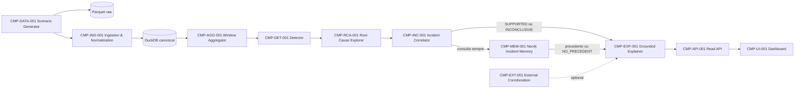

# Plano geral do sistema — Lumen

## 1. Controle do plano

- **Versão:** 1.3.0
- **Data:** 2026-08-29
- **Estado:** `PLAN READY`
- **Janela:** 19 horas totais; 15 horas para construção e 4 horas protegidas para integração, validação, ensaio e pitch.
- **Participantes:** André, Altoé, Rogério e Renato.
- **Fonte de verdade:** este arquivo.
- **Escopo:** MVP demonstrável de monitoramento, diagnóstico causal e memória de incidentes para uma plataforma fictícia de payment orchestration.
- **Base analisada:** repositório sem aplicação; apenas documentação e skills de planejamento.
- **Fontes externas:** documentação oficial da Yuno, DuckDB, Neo4j e OpenAI, listadas no fim.
- **Changelog:** 1.0.0 cria arquitetura, contratos, MVP, ownership, cronograma e planos individuais. 1.1.0 reafirma descoberta de causas novas como objetivo principal e posiciona memória como braço posterior para reconhecer recorrência e reaproveitar, com validação, o playbook anteriormente usado. 1.2.0 torna a consulta à memória obrigatória para todo incidente detectado, inclusive quando a evidência atual é inconclusiva, mantendo separados o status causal atual e o precedente histórico. 1.3.0 tipa o resultado da memória para diferenciar `MATCH_FOUND`, `NO_PRECEDENT` e `MEMORY_UNAVAILABLE` na API/UI.

## 2. Problema e produto

### Usuários e job

- **Operações de pagamentos:** descobrir rapidamente o que caiu, onde, por quê e qual ação humana investigar.
- **Executivo:** entender em uma linha o GMV local estimado em risco e o alcance.

### Critério de vitória

O sistema recebe uma nova combinação de dimensões não codificada previamente, detecta a anomalia, aponta o menor slice causal sustentado pelos dados, separa incidentes simultâneos e mostra evidências recalculáveis. Quando existir precedente, recupera o incidente confirmado e prioriza a solução anterior somente após validar sua aplicabilidade; sem precedente, continua com a causa nova e recomenda um playbook atual sem executar ação.

### Prioridades, em ordem

1. Precisão da causa raiz.
2. Evidência e honestidade (`INCONCLUSIVE` quando necessário).
3. Separação/priorização de incidentes simultâneos.
4. Memória de recorrência com explicação do porquê da similaridade.
5. Clareza operacional e executiva.
6. Tempo de detecção razoável para a demo, sem tratá-lo como métrica dominante.

### Fatos

- `FACT-001`: a banca exige detecção, diagnóstico dimensional, evidência, impacto, recomendação humana e trial by fire.
- `FACT-002`: a banca pode injetar qualquer nova combinação dentro do schema conhecido e alterar conversão, latência e/ou provider simultaneamente.
- `FACT-003`: não existe dataset; serão produzidos pelo menos 90 dias de histórico sintético.
- `FACT-004`: memória de incidente recorrente foi fortemente indicada pelo juiz e pertence ao MVP.
- `FACT-005`: antifraude completo e reinforcement learning são próximos passos, não MVP.
- `FACT-006`: recomendações vêm de catálogo de playbooks e nunca são executadas pelo agente.
- `FACT-007`: a verdade da causa do cenário é validada por humano; o detector não acessa `ground_truth`.

### Hipóteses controladas

- `ASM-001`: André será o owner de frontend e pitch, pois as especialidades informadas reservam Altoé para RAG/banco, Rogério para backend e Renato para computação. Validar no checkpoint H0:30; fallback: trocar somente ownership de `CMP-UI-001`, sem alterar contratos.
- `ASM-002`: haverá uma chave da OpenAI e uma instância Neo4j acessível. Validar até H1; fallback: explicação por template e memória em grafo local/in-memory usando o mesmo contrato.
- `ASM-003`: Python 3.11+ e Docker estarão disponíveis. Validar em H0:30; fallback: execução local sem containers.

### Não objetivos do MVP

- executar rerouting, retry, bloqueio, refund ou qualquer ação financeira;
- construir antifraude, ledger, reconciliação ou routing optimizer;
- treinar reinforcement learning;
- armazenar todas as transações no Neo4j;
- suportar providers reais ou dados pessoais reais;
- provar causalidade externa somente por notícia ou status page;
- criar seis agentes independentes por dimensão.

### Glossário operacional

- **Payment:** intenção comercial única.
- **Attempt:** tentativa de autorização enviada a um provider.
- **Event:** atualização de estado de um attempt.
- **Approval rate por attempt:** attempts aprovados / attempts elegíveis; métrica primária do detector de provider.
- **Payment conversion:** payments finalmente aprovados / payments únicos; métrica secundária para mostrar efeito de fallback.
- **Slice:** predicado sobre uma ou mais dimensões.
- **Incident signature:** representação estruturada de escopo, métricas, códigos, forma temporal e causa confirmada.

## 3. Demo e MVP

### Três capacidades essenciais

1. **Detectar:** observar fluxo acelerado e distinguir ruído sazonal de queda relevante em approval rate e/ou latência.
2. **Diagnosticar:** explorar `merchant × provider × method × country × issuer × brand × decline_code`, separar incidentes e produzir causa suportada ou `INCONCLUSIVE`.
3. **Lembrar e acelerar a resposta:** depois de formar o incidente atual como `SUPPORTED` ou `INCONCLUSIVE`, recuperar incidentes humanos confirmados no Neo4j, justificar a similaridade e, quando as precondições observáveis ainda forem válidas, recomendar ao humano o playbook que funcionou antes como orientação de investigação.

O objetivo primário é descobrir problemas atuais, inclusive combinações nunca vistas. Memória é um braço de enriquecimento e aceleração operacional; não é o mecanismo de descoberta nem uma condição para produzir diagnóstico.

### Menor fatia vertical — pronta até H4

1. Gerar baseline determinístico de 90 dias e fluxo normal.
2. Injetar `provider=stripe AND country=BR` com queda de approval e aumento de latência.
3. Gerar um `Incident` estruturado com slice, evidência, confiança e impacto.
4. Mostrar no dashboard um card operacional, uma linha executiva e um playbook.

### Roteiro final da demo

| Passo | Ação | Resultado esperado | Evidência |
| --- | --- | --- | --- |
| D1 | Iniciar stream normal | Nenhum alerta apesar de sazonalidade/ruído | gráfico + contador de janelas avaliadas |
| D2 | Injetar provider degradado somente no Brasil | Incidente isolado em provider × país | current vs baseline, n, p95, declines |
| D3 | Injetar emissor mexicano para um merchant | Segundo incidente independente | dois cards e contribuição separada |
| D4 | Repetir assinatura Mastercard de dois dias antes | Sistema aponta recorrência provável e recupera a solução anterior | ID passado, causa/playbook confirmados, precondições e fatores coincidentes/divergentes |
| D5 | Injetar queda difusa/baixo volume | Sistema usa `INCONCLUSIVE` | limitações e evidência faltante |
| D6 | Jurado escolhe nova combinação válida | Diagnóstico sem regra hardcoded | configuração secreta comparada após resposta |

### Caso obrigatório de memória

O seed inclui `INC-HIST-002D-MASTERCARD`, ocorrido exatamente dois dias antes, confirmado por humano. O incidente atual compartilha `card_brand=MASTERCARD`, slice estrutural, perfil de decline codes e forma de queda. A UI deve dizer “recorrência provável”, nunca “mesma causa” sem evidência atual, e mostrar:

- incidente anterior, tempo e status `HUMAN_CONFIRMED`;
- fatores que coincidem e fatores que divergem;
- score estruturado e score semântico separados;
- causa anterior e playbook anterior como precedente, não autoridade;
- evidências atuais que sustentam o diagnóstico corrente;
- precondições atuais que tornam o playbook anterior aplicável ou contraindicado.

### Regra de independência entre diagnóstico e memória

O diagnóstico corrente é produzido exclusivamente por métricas atuais, baseline, detector e RCA. A busca de memória acontece para **todo incidente detectado**, depois que ele já contém `root_cause.status`, confiança, evidências e limitações próprias — inclusive quando esse status é `INCONCLUSIVE`.

- `SUPPORTED + MATCH`: mantém a causa atual suportada, relata a recorrência e pode priorizar o playbook anterior após validar suas precondições;
- `SUPPORTED + NO_PRECEDENT`: mantém a causa atual suportada e relata que pode ser um problema novo;
- `INCONCLUSIVE + MATCH`: mantém a causa atual inconclusiva, mostra a causa humana confirmada e o playbook do precedente, explica fatores iguais/diferentes e usa o playbook somente como roteiro de investigação; o precedente não confirma a causa atual;
- `INCONCLUSIVE + NO_PRECEDENT`: relata ausência simultânea de causa atual sustentada e precedente semelhante, portanto o resultado final é inconclusivo e explicita os dados faltantes;
- `MEMORY_UNAVAILABLE`: acrescenta limitação operacional, mas não altera `root_cause.status`;
- o explainer recebe separadamente `current_diagnosis` e `memory_context`, evitando tratar precedente como prova atual ou ausência de memória como ausência de evidência transacional.

## 4. Decisões

| ID | Estado | Decisão | Razão | Consequência/Fallback | Owner | Flight Log |
| --- | --- | --- | --- | --- | --- | --- |
| DEC-001 | DECIDED | Precisão causal e memória recorrente pertencem ao MVP | são o núcleo e o bônus mais valorizado | cortar primeiro busca web, nunca RCA/memória | Team | FL-20260829-TEAM-003 |
| DEC-002 | DECIDED | Modelar Payment, Attempt e Event; detectar provider por approval por attempt e exibir conversion por payment | retries não podem distorcer a métrica | ambos têm nomes e denominadores explícitos | Team | FL-20260829-TEAM-003 |
| DEC-003 | DECIDED | Modular monolith Python com FastAPI, DuckDB/Parquet, Neo4j e Streamlit | menor risco de integração em 19h | adapters mantêm troca posterior possível | Team | FL-20260829-TEAM-004 |
| DEC-004 | DECIDED | Gerar linhas por NumPy/Polars, seed e regras; LLM gera apenas cenários/narrativas | volume, reprodutibilidade e ground truth | templates locais substituem LLM | Team | FL-20260829-TEAM-005 |
| DEC-005 | DECIDED | Detector hierárquico estatístico, não agentes por dimensão nem covariância como núcleo | dados categóricos, baixas contagens e trial by fire | covariância vira experimento pós-MVP | Team | FL-20260829-TEAM-006 |
| DEC-006 | DECIDED | Graph RAG híbrido: Cypher + similaridade estruturada + embedding rerank; somente incidentes confirmados | memória explicável e fallback determinístico | vetor é opcional; Cypher continua | Team | FL-20260829-TEAM-007 |
| DEC-007 | DECIDED | Um agente read-only explica e recomenda via Structured Output; código calcula fatos/confiança | reduz alucinação e preserva autoridade | template determinístico se API falhar | Team | FL-20260829-TEAM-007 |
| DEC-008 | DECIDED | Reservar H15–H19 para integração, acceptance, pitch e demo | working beats promised | cortes em ordem explícita em H10/H13 | Team | FL-20260829-TEAM-008 |
| DEC-009 | DECIDED | André recebe menos implementação e assume UI/pitch; demais owners seguem especialidades | protege comunicação sem abandonar integração | matriz abaixo | Team | FL-20260829-TEAM-008 |
| DEC-010 | SUPERSEDED | Descoberta causal atual é o núcleo; memória é enriquecimento posterior para reconhecer recorrência e reaproveitar playbook validado | refinada para cobrir explicitamente incidentes atuais inconclusivos | substituída por DEC-011 | Team | FL-20260829-TEAM-010 |
| DEC-011 | DECIDED | Consultar memória para todo incidente `SUPPORTED` ou `INCONCLUSIVE`, mantendo independentes a força da causa atual e a existência de precedente | um incidente humano anterior pode orientar a investigação mesmo quando os dados atuais ainda não isolam a causa | `INCONCLUSIVE + MATCH` mostra precedente e playbook como contexto, sem promover a causa atual; somente `INCONCLUSIVE + NO_PRECEDENT` encerra sem causa nem precedente | Team | FL-20260829-TEAM-011 |
| DEC-012 | DECIDED | Tornar `memory_status` obrigatório em CTR-MEM-001 v1.1 e expor Incident + memória + explicação separadamente na API | lista vazia não distingue ausência real de precedente de falha do Neo4j/fallback | migração coordenada das fixtures antes da implementação; UI nunca infere indisponibilidade por `matches=[]` | Team | FL-20260829-TEAM-012 |
| DEC-013 | DECIDED | Hospedar CMP-API-001/CMP-UI-001 (FastAPI + Streamlit) no Railway via Docker; Neo4j continua em Aura, fora do Railway | Docker/volume/env vars simples e trial de 30 dias cobre a janela do hackathon | migrar para Hobby ($5/mês) se o trial expirar antes da apresentação; fallback local de ASM-003 se o deploy falhar | Rogério | FL-20260829-ROGERIO-001 |

## 5. Arquitetura



O fluxo geral para leigos e as quatro projeções técnicas por responsável estão em `docs/plans/architecture-diagrams.md`.

### Componentes

| ID | Responsabilidade | Tecnologia | Owner | Health/falha explícita |
| --- | --- | --- | --- | --- |
| CMP-DATA-001 | 90 dias, stream acelerado, injeções e ground truth isolado | Python, NumPy, Polars, Faker opcional | Renato | seed, row count, distribution checks |
| CMP-ING-001 | validar, deduplicar, normalizar e quarentenar | Pydantic, Python | Rogério | accepted/rejected/duplicate counts |
| CMP-AGG-001 | janelas de 5 min por event time e rollups | DuckDB SQL | Rogério | watermark, lag, window count |
| CMP-DET-001 | approval e latência vs baseline sazonal | SciPy/NumPy | Renato | detector version, candidates/window |
| CMP-RCA-001 | beam search hierárquico e contribuição causal | Python | Renato | coverage, tested slices, pruning |
| CMP-INC-001 | separar/correlacionar/priorizar e calcular impacto | Python | Rogério | incident count, overlap, currency |
| CMP-MEM-001 | persistir e recuperar recorrência, causa confirmada e playbook anterior | Neo4j + driver + embedding opcional | Altoé | graph ping, retrieval trace |
| CMP-EXP-001 | explicar diagnóstico atual e recomendar playbook grounded, priorizando solução anterior quando aplicável | OpenAI Responses API, `gpt-5.6-terra` | Altoé | schema-valid, citation coverage, fallback |
| CMP-EXT-001 | consultar somente fontes oficiais após incidente | web search read-only | Altoé | timeout/source/`NOT_CHECKED` |
| CMP-API-001 | endpoints read-only e scenario control de demo | FastAPI | Rogério | `/health`, dependency states |
| CMP-UI-001 | dashboard, injection controls e pitch flow | Streamlit | André | render, API state, fallback demo |

### Escolha de stack

- **Python:** uma linguagem para dados, estatística, API, Neo4j e UI reduz handoffs.
- **Parquet + DuckDB:** histórico grande local, columnar, sem servidor; DuckDB consulta Parquet diretamente com filter/projection pushdown.
- **Neo4j:** apenas incidentes e relações; não é event store.
- **FastAPI:** uma fronteira HTTP única e tipada.
- **Streamlit:** entrega visual rápida; UI consome apenas `CTR-API-001`.
- **OpenAI:** Responses API com Structured Outputs e `gpt-5.6-terra`; `text-embedding-3-small` somente para rerank semântico. Nenhum fato é calculado pelo modelo.

### Persistência

| Dado | Store | Retenção MVP |
| --- | --- | --- |
| raw events | Parquet particionado por `event_date` | 90 dias + demo |
| canonical attempts/events | DuckDB | 90 dias + live |
| aggregates/baselines | DuckDB | versão do detector |
| incidents/evidence/playbooks | DuckDB | todos |
| incident graph/signatures | Neo4j | somente incidentes fechados/confirmados e atuais |
| ground truth | arquivo separado, inacessível ao detector/UI até validação | cenários de teste |

### Tratamento de eventos

- deduplicação por `event_id`; hash auxiliar para payload repetido;
- watermark inicial de 2 minutos para demo; late events dentro do limite revisam a janela;
- evento antigo não regride terminal state;
- `UNKNOWN` para resultado de provider ambíguo; nunca converter timeout em decline conhecido;
- schema inválido, moeda/unidade ambígua ou tempo impossível vai para quarantine;
- raw é imutável; canonical registra `normalization_version` e `raw_event_id`.

### Método estatístico

1. Agregar janelas de 5 minutos por dimensões elegíveis.
2. Baseline sazonal por `weekday × time_bucket`, com pooling hierárquico.
3. Approval: posterior Beta-Binomial/Wilson, queda absoluta, queda relativa, amostra mínima e lost approvals.
4. Latência: median/p95, MAD robusto e timeout share.
5. Gerar candidatos somente quando volume, efeito e persistência passam thresholds versionados.
6. Explorar dimensões em beam search até profundidade 3; não enumerar produto cartesiano completo.
7. Score de RCA combina `loss_coverage`, força estatística, consistência temporal, qualidade do dado e penalidade de complexidade.
8. Se nenhum slice atual cobre o mínimo confiável, produzir `INCONCLUSIVE` com evidência faltante; esse estado é decidido independentemente da memória, mas ainda dispara a consulta histórica.
9. Separar candidatos por overlap de attempts, intervalo e assinatura; priorizar por GMV local em risco, lost approvals, alcance e confiança.
10. Consultar memória após formar todo incidente, seja `SUPPORTED` ou `INCONCLUSIVE`; lista vazia significa caso sem precedente, não evidência insuficiente por si só.
11. Quando houver precedente, comparar as precondições do playbook anterior com escopo, métricas, sinais e limitações atuais. Em causa suportada, ele pode ser priorizado; em causa inconclusiva, é apenas roteiro de investigação. Sempre usar rationale e `HUMAN_ONLY`.

### Impacto financeiro

```text
expected_approvals = eligible_attempts × baseline_approval_rate
lost_approvals = max(0, expected_approvals - observed_approvals)
gmv_at_risk_minor = lost_approvals × historical_average_ticket_minor
```

Sempre rotular `GMV estimado em risco`, na moeda local, com intervalo e método. Não afirmar lucro ou receita perdida.

### Segurança e autoridade financeira

- dados integralmente sintéticos; nenhum PAN/CVV/PII real;
- agente, RAG e web são read-only;
- playbooks usam `HUMAN_ONLY` e não possuem tool de execução;
- conteúdo recuperado não muda prompt, permissões ou política;
- secrets somente em env vars, nunca no repo/log;
- sandbox/demo claramente identificados.

## 6. Catálogo de dados

Os JSON Schemas executáveis ficam em `contracts/v1/`; exemplos em `contracts/fixtures/`.

### DATA-001 — Canonical Payment Attempt/Event

Campos obrigatórios: `schema_version`, `event_id`, `event_type`, `event_time`, `received_at`, `payment_id`, `attempt_id`, `attempt_sequence`, `merchant_id`, `provider_id`, `country`, `currency`, `amount_minor`, `payment_method_category`, `status`, `timing`, `correlation_id`, `is_test`. Dimensões opcionais: issuer, brand, card type, provider connection, normalized decline. Raw payload permanece por referência.

### DATA-002 — Window Metrics

Chave: `window_start`, `window_end`, `dimensions`, `detector_version`. Métricas: `eligible_attempts`, `approved_attempts`, `unique_payments`, `approved_payments`, `amount_minor`, `approval_rate`, `payment_conversion`, `latency_p50_ms`, `latency_p95_ms`, `timeout_rate`, `decline_counts`.

### DATA-003 — Incident

Inclui state, onset, slices, métricas current/baseline, ranked causes, evidências, confiança decomposta, impacto, memória, limitações, playbooks e audit timestamps.

### DATA-004 — Incident memory graph

Nós: `Incident`, `Merchant`, `Provider`, `Country`, `PaymentMethod`, `Issuer`, `CardBrand`, `DeclineCode`, `Cause`, `Playbook`.

Relações: `AFFECTED`, `DOMINATED_BY`, `CONFIRMED_AS`, `RECOMMENDED`, `SIMILAR_TO`, `FOLLOWED_BY`, `RESOLVED_WITH`.

Somente causa `HUMAN_CONFIRMED` pode ser apresentada como precedente confirmado.

## 7. Catálogo de contratos

| ID/versão | Produtor → consumidores | Propósito e timing | Erros/fallback | Owner | Mock/test |
| --- | --- | --- | --- | --- | --- |
| CTR-SCN-001 v1 FROZEN | DATA → ING/DET/UI | configuração de baseline/injeção e ground truth isolado | `INVALID_SCENARIO`; fixture local | Renato | `scenario-provider-br.json` |
| CTR-EVT-001 v1 FROZEN | DATA → ING | canonical attempt event; at-least-once, event-time | quarantine, dedupe, watermark | Rogério | `canonical-attempt.json` |
| CTR-AGG-001 v1 FROZEN | AGG → DET/RCA | métricas por janela fechada/revisada | `INSUFFICIENT_VOLUME` | Rogério | schema + fixture no plano de Rogério |
| CTR-DET-001 v1 FROZEN | DET → RCA/INC | candidato estatístico, nunca narrativa | `NO_ANOMALY`, `DATA_QUALITY_LOW` | Renato | schema + unit fixtures |
| CTR-INC-001 v1 FROZEN | INC → MEM/EXP/API | incidente auditável e versionado | `INCONCLUSIVE` é resultado válido | Rogério | `incident-mastercard-recurrence.json` |
| CTR-MEM-001 v1.1 FROZEN | MEM → EXP/API | `memory_status` tipado + top-k precedentes, causa/playbook anteriores e trace para Incident `SUPPORTED` ou `INCONCLUSIVE`, sem alterar `root_cause` | `MATCH_FOUND`, `NO_PRECEDENT` ou `MEMORY_UNAVAILABLE`; somente os dois últimos exigem `matches=[]` | Altoé | quatro fixtures `similar-incidents*.json`, incluindo unavailable |
| CTR-LLM-001 v1 FROZEN | EXP → API/UI | resumo ops/executivo + playbook + evidence IDs | template determinístico | Altoé | schema Structured Output |
| CTR-EXT-001 v1 PROPOSED | EXT → EXP | corroborar fonte oficial, não provar causa | timeout 5s, `NOT_CHECKED` | Altoé | stub vazio |
| CTR-API-001 v1 FROZEN | API → UI | health, metrics, incidents, inject scenario | 4xx estável; timeout 2s UI | Rogério | OpenAPI + fixture |

### Regras transversais dos contratos

- IDs são strings opacas; valores monetários `int64` em unidade mínima; moeda ISO 4217.
- timestamps são UTC ISO 8601; durations terminam em `_ms`; taxas variam de 0 a 1.
- toda resposta carrega `schema_version`, `correlation_id` e, quando aplicável, versão de baseline/detector/modelo.
- mudanças incompatíveis exigem v2 e atualização coordenada; campo opcional novo é compatível.
- chamadas LLM e Neo4j possuem timeout, no máximo uma retry segura e fallback local.
- `CTR-MEM-001` é uma etapa obrigatória com fallback: recebe todo Incident; `memory_status` nunca modifica `CTR-INC-001.root_cause`; consumidores não inferem falha por lista vazia.
- nenhuma autenticação de produção será implementada; serviço local de demo é bindado a localhost.

## 8. Ownership e colisões

| Área/hotspot | Owner primário | Revisores/consumidores | Regra de mudança |
| --- | --- | --- | --- |
| `contracts/v1/`, enums e fixtures | Rogério | todos | mudança via CTR + aviso imediato |
| generator/scenarios | Renato | Rogério, André | não alterar schema canonical |
| detector/RCA | Renato | Rogério | outputs somente CTR-DET/INC |
| API, DuckDB schema, migrations | Rogério | Renato, Altoé, André | coordenador único |
| Neo4j schema/retrieval/prompts | Altoé | Rogério | não duplicar source of truth transacional |
| Streamlit/UI | André | Rogério | consumir API, sem SQL direto |
| `pyproject.toml`/lockfile | Rogério | todos | alterações serializadas |
| `.env.example` | Rogério | Altoé | nomes sem valores |
| `docs/flight-log.md` Team lane | André como recorder nesta fase | todos | append-only |
| integração/checkpoints | Rogério | todos | preflight e contrato antes de merge |

## 9. Objetivos e microtarefas

### OBJ-ANDRE-001 — Tornar o diagnóstico compreensível e demonstrável

Owner: André. Orçamento de implementação: 6–7h; restante protegido para integração visual, pitch e ensaio. Entregas: dashboard, controles de injeção, resumo dual-audience, roteiro e fallback gravado/local.

### OBJ-ALTOE-001 — Provar memória recorrente grounded

Owner: Altoé. Orçamento: 13–14h. Entregas: grafo, seed de incidente de dois dias antes com resolução, recuperação híbrida, validação de aplicabilidade do playbook, explainer e `NO_PRECEDENT` seguro.

### OBJ-ROGERIO-001 — Prover espinha dorsal contratual e integração

Owner: Rogério. Orçamento: 13–14h. Entregas: schemas, ingestion, DuckDB, agregação, incident correlation/impact, API e checkpoints.

### OBJ-RENATO-001 — Produzir dados e diagnóstico causal preciso

Owner: Renato. Orçamento: 13–14h. Entregas: histórico/stream, detector, RCA, simultaneous incidents e evaluation dataset.

As microtarefas completas estão nos planos individuais e foram publicadas no projeto
[Lumen — Yuno Hackathon](https://linear.app/lumenhack/project/lumen-yuno-hackathon-fd0533f171d5).
Os épicos de ownership são [LUM2-4](https://linear.app/lumenhack/issue/LUM2-4/entregar-narrativa-dashboard-e-demo-executiva),
[LUM2-5](https://linear.app/lumenhack/issue/LUM2-5/entregar-memoria-graphrag-e-explicacao-grounded),
[LUM2-6](https://linear.app/lumenhack/issue/LUM2-6/entregar-ingestao-contratos-e-api-integradora) e
[LUM2-7](https://linear.app/lumenhack/issue/LUM2-7/entregar-dados-sinteticos-deteccao-e-rca).
O mapeamento completo e auditado está em `docs/plans/linear-preview.md`.

## 10. Dependências e tempo

```text
CTR schemas/fixtures
 ├─ generator → ingestion → aggregation → detector → RCA → incident
 ├─ incident → memory retrieval → explanation
 └─ incident/explanation → API → dashboard → demo
```

| Tempo | Checkpoint | Saída obrigatória | Corte se falhar |
| --- | --- | --- | --- |
| H0–H1 | Contratos | env, schemas, fixtures, health stubs | vector rerank adiado |
| H1–H4 | Fina vertical | provider BR aparece na UI com evidência | usar baseline pré-agregado |
| H4–H8 | Profundidade | RCA hierárquico + memória Mastercard | cortar web externo |
| H8–H11 | Casos difíceis | simultâneos + `INCONCLUSIVE` + dedupe/late | cortar animação/polimento |
| H11–H13 | Trial by fire | holdout de nova combinação passa | reduzir dimensões de depth 3 para top-k |
| H13–H15 | Integração | smoke/E2E, fallback e code freeze | nenhuma feature nova |
| H15–H17 | Acceptance | navegador, regressão, Q&A técnico | usar roteiro determinístico |
| H17–H19 | Pitch/demo | ensaio completo e contingência | somente correção bloqueante |

## 11. Git e integração

- Branch base: `main`; branches curtas `feat/<ID>-resumo`.
- Ordem de integração: contratos → generator/ingestion → detector/RCA → incident/API → memory/explainer → UI.
- Cada merge roda schema validation, unit tests afetados e smoke de fixture.
- Checkpoint H4 roda a fatia completa antes de aprofundar.
- Mudança em contrato começa neste plano, recebe versionamento e depois atualiza produtor/consumidores.
- `docs/flight-log.md` é append-only; conflitos preservam todas as entradas.

## 12. Qualidade e avaliações

### Métricas do sistema

- `root_cause_top1_accuracy` — principal;
- `root_cause_scope_exact_match`;
- `false_incidents_per_normal_run`;
- `simultaneous_incident_separation_rate`;
- `inconclusive_precision`;
- `memory_recurrence_precision_at_1`;
- `evidence_citation_coverage`;
- `impact_estimation_error`;
- latência por estágio, como métrica secundária.

### Dataset de avaliação

- development cases conhecidos;
- holdout com novas combinações não usadas nos thresholds;
- ground truth em arquivo separado;
- casos normal, baixo volume, provider-country, merchant-issuer, Mastercard recurrence, latência-only, simultâneos, mix shift, duplicate, late/out-of-order, unknown decline e inconclusive.

### Gates antes de conclusão de código

1. testes automatizados proporcionais;
2. `code-review-gate` no diff;
3. correção de bloqueantes;
4. `browser-acceptance-gate` no fluxo real;
5. `integration-contract-guardian` antes de merge.

## 13. Riscos e contingências

| ID | Risco | Sinal | Mitigação/Fallback | Owner/deadline |
| --- | --- | --- | --- | --- |
| RSK-001 | Neo4j indisponível | health falha H1 | graph adapter in-memory e fixture | Altoé/H1 |
| RSK-002 | API OpenAI indisponível | timeout/schema inválido | template grounded; memória continua | Altoé/H4 |
| RSK-003 | histórico grande lento | benchmark >60s | reduzir raw rows, preservar 90d aggregates | Renato/H2 |
| RSK-004 | falso RCA por baixa amostra | baixa coverage/unstable slice | pooling, min n, `INCONCLUSIVE` | Renato/H8 |
| RSK-005 | branches divergem em schema | fixture não valida | Rogério coordena contrato único | Rogério/contínuo |
| RSK-006 | frontend vira caminho crítico | API/UI mismatch | fixture local e deterministic demo mode | André/H4 |
| RSK-007 | memória vaza ground truth | mesma origem/arquivo acessível | stores e interfaces separados | Altoé+Renato/H8 |
| RSK-008 | external web cria falsa confirmação | fonte genérica | rotular `CORROBORATION`, nunca causa | Altoé/H11 |
| RSK-009 | trial Railway (30 dias) expira antes da apresentação | build/host indisponível ou cobrança inesperada | migrar para Hobby ($5/mês) ou cair no fallback local de ASM-003 | Rogério/contínuo |

## 14. Parecer do Integration Contract Guardian — modo PLANNING

**Resultado: `PLAN READY`.**

- Fronteiras principais possuem IDs, owners, versões, fixtures e fallbacks.
- Dependências paralelas começam por contratos/fixtures, não por código alheio.
- Hotspots de schema, lockfile, API, env e Flight Log possuem coordenador único.
- O caminho crítico produz aplicação executável em H4, H8 e H15.
- Não há ciclo obrigatório: UI usa fixture; memória aceita Incident fixture; detector usa WindowMetrics fixture.
- External web, vector rerank e LLM têm fallback e não bloqueiam diagnóstico.
- A revisão 1.3.0 mantém o grafo acíclico, mas substitui CTR-MEM-001 v1 por v1.1 antes de qualquer implementação: `memory_status` agora é obrigatório e todas as fixtures produtoras/consumidoras foram migradas em conjunto.
- `ASM-001..003` têm prazo H1 e não alteram contratos públicos.

## 15. Estratégia para a banca

| Lente | Evidência planejada |
| --- | --- |
| Funciona | normal silencioso, dois incidentes, recurrence e holdout ao vivo |
| Profundidade | denominadores explícitos, RCA por contribuição, memória não-gating, no-answer e event-time |
| Problema real | provider/approval/latency e dimensões da Yuno |
| Originalidade | descoberta causal para combinações inéditas + memória humana confirmada que acelera resposta ao sugerir solução anterior aplicável |
| Clareza | uma linha executiva + drill-down operacional + evidence IDs |

Perguntas de defesa: por que não LLM por dimensão; por que DuckDB e não Kafka; por que Neo4j não armazena transações; como evitamos Simpson's paradox; como `INCONCLUSIVE` é decidido; como sabemos que recorrência não é coincidência; o que acontece sem internet/API.

## 16. Fontes técnicas

- Yuno: https://www.y.uno/
- Yuno routing: https://docs.y.uno/docs/using-yuno/dashboard-overview/routing
- Yuno reports fields: https://docs.y.uno/reference/reports/reports-fields
- Yuno response/MAC codes: https://docs.y.uno/reference/payments/status-and-response-codes/transaction
- DuckDB e Parquet: https://duckdb.org/docs/current/guides/file_formats/query_parquet
- Neo4j GraphRAG Python: https://neo4j.com/docs/neo4j-graphrag-python/current/index.html
- OpenAI models: https://developers.openai.com/api/docs/models
- OpenAI Responses API: https://developers.openai.com/api/reference/cli/resources/responses/methods/create
- OpenAI embeddings: https://developers.openai.com/api/docs/models/text-embedding-3-small
